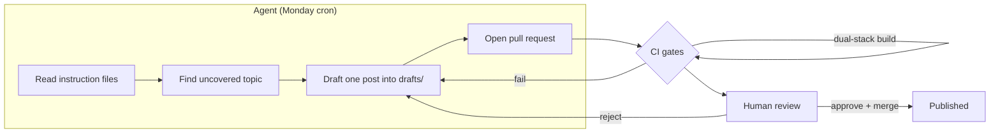

Most consultancies bolt a chat assistant onto an unchanged workflow and call it an artificial intelligence (AI) strategy. That produces exactly what you would expect: output that varies with whoever held the keyboard that day, no record of why a decision was made, and no way to fix a systematic error once instead of a hundred times by hand. This document is the opposite approach, written down. It is how BASH Consulting runs its own operation — this website, its content, its code, its images — on governed AI, and why the architecture is the same one we would build for a client who wants AI to do real work without becoming an unauditable liability.

The through-line is the BASH doctrine, applied to ourselves first: deterministic, auditable foundations carry the load; AI is an overlay, not the load-bearing wall. Every mechanism below exists to make the non-deterministic part — the model — operate inside a deterministic frame it cannot escape. If you want the reasoning behind that stance, read [[The deterministic-first doctrine]]. This page is the working implementation. Everything here lives in one public repository, the [bashconsultants repository on GitHub](https://github.com/bamr87/bashconsultants), so you can read the actual files rather than take our word for it.

## The core inversion: prompts are units of work, not conversations

A chat transcript is the wrong unit of work. It is ephemeral, unversioned, unreviewable, and impossible to diff. The moment a recurring task matters — drafting an article, reviewing it against a style guide, generating a test suite — the transcript should stop being a conversation and become an artifact under source control.

In this practice, every recurring task is a `.prompt.md` file in `.github/prompts/`. Each one is a small, reviewable contract with four parts: the **role** the model adopts, the **inputs** it consumes (usually the active file plus named context), the **task** in imperative steps, and the **quality bar** it must clear before the output is considered done. Because these files are Markdown in Git, they get pull requests, blame, and history. When an article keeps coming back with the wrong heading case, you do not re-teach the model in chat — you edit one line of `article-review.prompt.md`, and every future review inherits the fix. That is the same move that makes infrastructure-as-code better than clicking in a console.

The current library, generated directly from the repository so this table never drifts from the files:

{:table .table .table-striped}
Prompt | What it does
---------|----------

{{ prompt.name }} | {{ prompt.description }}


A few properties worth calling out for a practitioner deciding whether to copy this:

- **Prompts are typed by mode.** Each declares `mode: agent`, meaning it expects tool access (read files, run commands, open pull requests), not a single completion. That distinction drives everything about how it is allowed to run.
- **Prompts compose.** `article-write` drafts, `article-review` grades against the same rules the draft was written to, and `commit-publish` validates the build before anything ships. The pipeline is three small prompts, not one giant one — easier to test, easier to reason about, and each stage fails loudly on its own terms.
- **Prompts are portable.** The `.github/prompts/` convention is not ours; it is the location Microsoft's tooling reads. That means the same files drive our custom orchestrator, GitHub Copilot's prompt-file feature, and any editor that adopts the format, per the [VS Code prompt and instruction files documentation](https://code.visualstudio.com/docs/copilot/customization/prompt-files). We chose an open convention on purpose so the playbook is not hostage to one vendor's client.

## Instruction files are the editorial authority

Prompts say *do this task*. Instruction files say *these are the standing rules for this kind of file, whoever or whatever is working on it*. They are the constitution to the prompts' legislation.

Every `.instructions.md` file in `.github/instructions/` carries an `applyTo` glob. When a model — or a human reading the repo — touches a file matching that glob, those rules apply with the authority of an editor's red pen. The content style guide governs everything customer-facing under `pages/`. The posts rules govern the blog collection's frontmatter and structure. The extension rules govern TypeScript conventions under `extension/`. The prompt-authoring rules govern the prompt files themselves, which keeps the meta-layer honest.

{:table .table .table-striped}
Rule set | What it governs
---------|----------

{{ instruction.name }} | {{ instruction.description }}


The architectural point is separation of concerns. A prompt should not restate the house style; it should assume the style exists and reference it. When the banned-phrase list changes, you edit one instruction file, not eleven prompts. This is the same reason you keep validation rules out of every controller and put them in one schema. The `applyTo` glob is the routing table that binds the rule to the surface it governs, so authority is scoped rather than global — the extension's TypeScript rules never bleed into a Markdown page, and the content style guide never lectures a build script.

This is also where governance stops being a slogan. "Human in the loop" means nothing if the human has no fixed standard to check against. The instruction files *are* that standard, written once, applied uniformly, and diffable when they change. A law firm could encode engagement-letter requirements this way; a clinic could encode its privacy obligations into the rules that govern patient-facing text, so the constraint travels with the file type instead of living in one careful person's memory.

## The orchestrator: running the playbook from the editor

A library of prompts is inert without a runner. The [Prompt Orchestrator extension](https://github.com/bamr87/bashconsultants/tree/main/extension) is a small VS Code extension — TypeScript, built with esbuild, MIT-licensed, run from source — that turns the file-based playbook into something you drive from the editor without leaving your work.

What it does, concretely:

- **Discovers prompts.** On activation it scans `.github/prompts/` (configurable via `promptOrchestrator.promptsDirectory`), parses each file's frontmatter, and loads it into a `PromptManager`. Add a file, refresh, and it appears — no rebuild.
- **Presents a sidebar view.** A tree view in the Explorer lists every discovered prompt by name and description, so the playbook is browsable rather than a folder you have to remember the contents of.
- **Runs a prompt against the active file.** Pick a prompt, and the extension formats it with the current editor's file as context, then offers three execution paths.

Those three paths are deliberate, and they map to a spectrum from most integrated to most portable:

1. **Send to Chat (Copilot).** Hand the formatted prompt to GitHub Copilot Chat for an interactive, tool-using turn.
2. **Execute with the Language Model application programming interface (API).** Call VS Code's built-in Language Model API directly and stream the result into an output channel — no chat panel needed.
3. **Copy to clipboard.** Format the prompt with context and put it on the clipboard for any tool at all.

The fallback ladder is the point. The clipboard path always works, even with no Copilot subscription and no Language Model API access, because the deterministic part — assembling the right prompt with the right file as context — is done by our code, not by any model. The AI is an interchangeable backend behind a stable, file-driven front end. If a vendor changes terms tomorrow, the playbook does not move; only the last mile does. That is the doctrine expressed as software architecture.

```text
.github/prompts/*.prompt.md   ─┐
.github/instructions/*.md      ─┤  read by
                                ├──►  Prompt Orchestrator (VS Code)
active editor file  ───────────┘        │
                                         ├─► Copilot Chat
                                         ├─► Language Model API
                                         └─► Clipboard (always available)
```

For the mechanics of the wider content and image pipeline this sits inside, see the practice's public [AI operations walkthrough](/ai-operations/).

## The image pipeline: deterministic wrapper, generative core

The same pattern governs preview images. Every article needs a banner, and generating them by hand does not scale. So the repository ships a generator — a shell script and a Jekyll plugin — that produces one preview image per page using OpenAI's `gpt-image-2` model at roughly \$0.15 to \$0.20 per image.

The design discipline here is worth studying because it is the whole doctrine in miniature. The **filename is derived deterministically from the article title** — same title in, same target path out — so the system is idempotent: it never regenerates an image that already exists, and a rerun is a no-op rather than a fresh bill. The generative model is called exactly once, only for the pixels, and only when a slot is genuinely empty. Everything around that call — which pages need images, what the target path is, whether to skip — is deterministic code you can reason about and test. The model is the paintbrush; the pipeline decides whether to paint at all, and where the canvas goes. That is why the run is cheap and predictable instead of a surprise invoice: the expensive non-deterministic step is fenced inside a cheap deterministic frame.

## CI gates and scheduled agents: agents draft, humans approve

None of the above is trusted on faith. The repository's continuous integration (CI) is the enforcement layer that makes "human approves" a mechanical guarantee rather than a good intention.

Every change runs through a build-and-validate workflow before it can merge. Two gates matter most for an AI-native practice:

- **Content lint.** A Python checker (`scripts/content_lint.py`) enforces the frontmatter contract, search-engine-optimization (SEO) length limits, and the banned-phrase list on reader-facing content — the same editorial rules the instruction files declare, now enforced by a machine that does not get tired or persuaded. It even self-tests against fixtures so the linter itself stays honest.
- **Dual-stack build.** The site is built twice, against both production-relevant configuration stacks (the GitHub Pages remote-theme stack and the Azure gem-theme stack), so a page that renders in one environment but breaks the other never reaches production.

A change that fails a gate does not merge. That is the entire trust model: the model can propose anything, but only output that passes deterministic checks and a human review gets in.

On top of the gates sits a scheduled agent. The **content gardener** runs every Monday morning (Denver time) as a GitHub Actions workflow. It reads the editorial instruction files, surveys existing posts to find an uncovered topic tied to a service, drafts exactly one blog post into `drafts/`, and opens a pull request. It is explicitly forbidden from pushing to `main` — its allowed-tools list permits reading, writing, and opening a pull request, and nothing else. A human reviews the draft, moves it into place, and merges. The agent generates; the person decides.



The reason this is safe is structural, not attitudinal. The agent has narrow, enumerated permissions. Its output lands in a quarantine directory, not in the live collection. Every draft passes the same lint and build gates as human work. And the merge — the only irreversible step — is reserved for a person. Give an agent broad write access and skip the gates, and you have built an unaccountable coworker. Constrain it this way, and you have built a productive one.

## Anti-patterns this architecture rejects

For a senior practitioner deciding what to adopt, the failure modes are as instructive as the mechanisms:

- **Prompts trapped in chat history.** If your best prompt lives in someone's scrollback, it is not an asset — it is a single point of failure with a person attached. Version it or lose it.
- **Governance as vibes.** "We have standards" that live in people's heads produce output that varies with staffing. Standards that live in `applyTo`-scoped files produce output that varies with the rules, which you can see and change.
- **The mega-prompt.** One enormous prompt that drafts, reviews, formats, and ships is impossible to test and impossible to debug when a single stage misbehaves. Decompose into small, composable prompts with clear seams.
- **Vendor lock-in at the core.** If your whole workflow dies when one model provider changes its terms, the model is your load-bearing wall. Keep the deterministic assembly in your own code and treat the model as a swappable backend.
- **Agents with broad write access.** An agent that can push to `main` is a liability no matter how good its output usually is. Enumerate its tools, quarantine its output, and reserve the merge for a human.
- **Skipping the gates because output "looks right."** Looking right is precisely the risk with generative systems. The lint and build gates exist so that "looks right" is never the standard that ships.

## What this means for a client engagement

We run the practice this way because it is what we would build for you, scaled to your stakes. A distribution business with roughly 40 staff does not need a VS Code extension, but it does need the same shape: recurring work captured as reviewable, version-controlled instructions rather than tribal knowledge; a written standard that AI output is checked against; automated gates that catch errors before a customer or a regulator does; and a hard rule that a person owns every result that has an effect. The tooling is specific to us. The doctrine transfers to any operation that wants AI to do real work without becoming a black box.

If you want to see how the same discipline applies to production AI systems — retrieval, agents, guardrails, and evaluation harnesses — read [[Production AI: RAG, agents, guardrails, and evals]], which extends this operating model from an internal practice to systems you put in front of users.

Building this kind of governed, auditable AI operation is exactly what our [[AI solutions and intelligent automation]] service does for small and medium businesses. If you want an AI practice you can actually stand behind, [start a conversation](/contact/).
