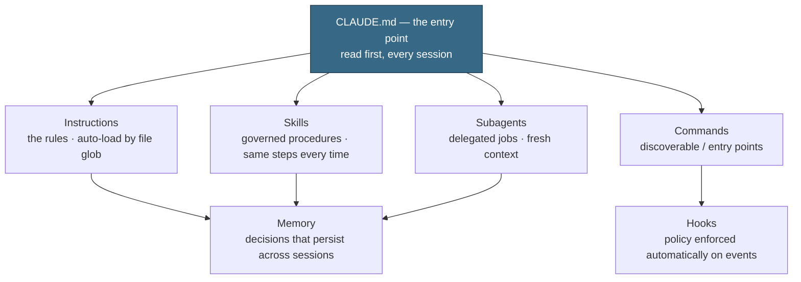

Most teams meet artificial intelligence (AI) as a chat window: a thousand one-off conversations, a
different result every time, nothing that survives the session. A BASH partner builds the opposite —
a **context framework**: the rules, playbooks, and agents a project needs, written into the
repository itself so the AI works the same governed way for everyone, every time. This guide is how
we build one. Its worked example is the repository you are reading — this site is its own reference
implementation, which is the point.

The pattern is Claude-native but not Claude-only: it follows the tool-neutral [agents.md](https://agents.md/)
convention, so the same files steer other coding agents too. Read [[Running an AI-native consulting practice]]
for the practice around it and [[Production AI: RAG, agents, guardrails, and evals]] for the systems
it produces. This guide is the substrate under both.

## What a context framework is

A context framework is the set of files that tells an AI agent — and a human — what "good" means in
this codebase, and gives them repeatable ways to produce it. It has one job: **make AI output a
property of the project, not of whoever happened to run the prompt.** When the rules live in files,
quality stops depending on who is working or what they remembered to ask for. Fix a rule once and
every future piece of work inherits the fix.

It rests on the BASH doctrine (see [[The deterministic-first doctrine]]): deterministic foundations
first, the model spent only where judgment is genuinely needed, and a named person approving anything
that reaches a customer.

## The layers

Seven layers, each a different kind of file, each with one concern. They compose from a single entry
point downward.

### Layer 1 — the entry point: `CLAUDE.md`

One file at the repository root that every session reads first. It does not repeat everything; it
**routes**. It states what the project is, points to the deeper layers, and carries the handful of
operating rules an agent must never skip — how to validate, what never to commit, who approves. Keep
it short enough that reading it costs nothing and skipping it is never worth it.

### Layer 2 — rules that load themselves: instruction files

Standards, split by concern, that attach to the files they govern. In this repo, editorial voice,
brand identity, and page-type rules live in `.github/instructions/*.instructions.md`, each with an
`applyTo` glob. When an agent — or a person — opens a matching file, the right rules load
automatically and carry the same weight an editor's red pen would. A law office could run engagement
letters this way; a clinic could run patient communications this way, with its privacy obligations
written into the rules rather than left to memory.

### Layer 3 — governed procedures: skills

A recurring task written down once so it runs the same way every time: the steps, the standard, and
the check at the end. Drafting a page, running the editorial gate, authoring a document to spec —
each becomes a **skill** the agent invokes by name instead of improvising. Skills can bundle
deterministic scripts alongside their instructions, so the parts that should never vary simply don't.

### Layer 4 — delegated jobs: subagents

Some work is best handed to a specialist with a clean context and a narrow remit: review this draft,
validate this build, audit this against the brand. A **subagent** runs that job in isolation, reports
back, and keeps the main thread uncluttered. Each has a sharp description of when to use it and stays
in its lane — the editor does not opine on the build; the build validator does not rewrite copy.

### Layer 5 — discoverable triggers: commands

The human-facing surface: a one-word `/command` that runs a common workflow. Commands are thin — they
wrap a skill or a subagent — but they make the framework usable without memorizing it. `/lint-content`,
`/new-toolkit-doc`, `/brand-check`: the workflow is named, versioned, and one keystroke away.

### Layer 6 — decisions that persist: memory

Agents forget between sessions unless you let them remember. Scoped **memory** files record the
decisions that should carry forward — the recurring correction, the project-specific convention — so
the same note never has to be made twice. Memory is small, specific, and reviewed; it is not a
transcript.

### Layer 7 — policy that enforces itself: hooks

The last layer removes the human from the loop only for enforcement, never for judgment. A **hook**
fires on an event — a tool call, a commit — and applies policy mechanically. This repo uses one to
require that pull-request review comments are read before a task is called done. Hooks are where
"you must always" becomes "it happens automatically."

## The worked example

Everything above is live in this repository. The map is deliberately boring to navigate:

| Layer | Where it lives here |
|---|---|
| Entry point | `CLAUDE.md` (root) |
| Rules | `.github/instructions/` — brand, content style, page types |
| Portable playbooks | `.github/prompts/` — the tool-neutral prompt library |
| Skills | `.claude/skills/` — editorial gate, doc authoring, wikilinks, brand |
| Subagents | `.claude/agents/` — editorial review, build validation, brand audit |
| Commands | `.claude/commands/` |
| Memory | `.claude/agent-memory/` |
| Hooks | `.claude/hooks/`, `.claude/settings.json` |

The public account of how it runs day to day is [/ai-operations/](/ai-operations/); the map of the
Claude layer is `.claude/README.md`. The framework governs the very content you are reading: this
page was written against those rules, checked by that editorial gate, and validated by that build.

## Deterministic where it counts

The discipline that keeps a context framework honest is knowing which layers are for judgment and
which are for certainty. Instructions and skills describe *intent*; underneath them, plain scripts do
the *invariant* work — generating the tool tables from the actual source files, building the static
site so the same input yields the same output, linting content against mechanical rules. AI is spent
on drafting, reviewing, and deciding. Everything repeatable is a script that fails loudly and
predictably. That split is what makes the model's contribution safe to ship — it is bounded by
determinism on every side.

## Building one for a client

The engagement mirrors how we run [[The BASH engagement method]]. You are not installing a tool; you
are drawing the line through a process between what needs judgment and what just needs to run the
same way every time, then encoding both.

1. **Map the recurring work.** Which tasks happen over and over — proposals, order confirmations,
   patient letters, release notes? Those are the candidates for skills and playbooks.
2. **Write the rules down.** Turn the standards that live in someone's head into instruction files
   scoped to the work they govern. This is usually the highest-leverage day of the engagement.
3. **Make the invariant parts deterministic.** Anything that should never vary becomes a script, not
   a prompt.
4. **Give judgment to agents, approval to people.** Draft with subagents; keep a named human on
   everything customer-facing. The framework compresses the hours to a finished draft; it never
   publishes.
5. **Leave it owned and portable.** The framework is plain files in the client's own repository,
   following an open convention — inspectable, versionable, and yours to keep. No lock-in, to a
   vendor or to us. That is the same standard we hold partners to; see
   [[The small-business IT foundation]] for where a client's version of this starts.

## Why this is the partner bar

Anyone can open a chat window. Building a governed context framework — one that survives the session,
teaches the next contributor, and holds a quality line without a person watching — is the
demonstrated skill that separates a BASH partner from an operator of a chatbot. If you build systems
this way and want to bring them to the businesses that need them most, [start a conversation](/contact/).
