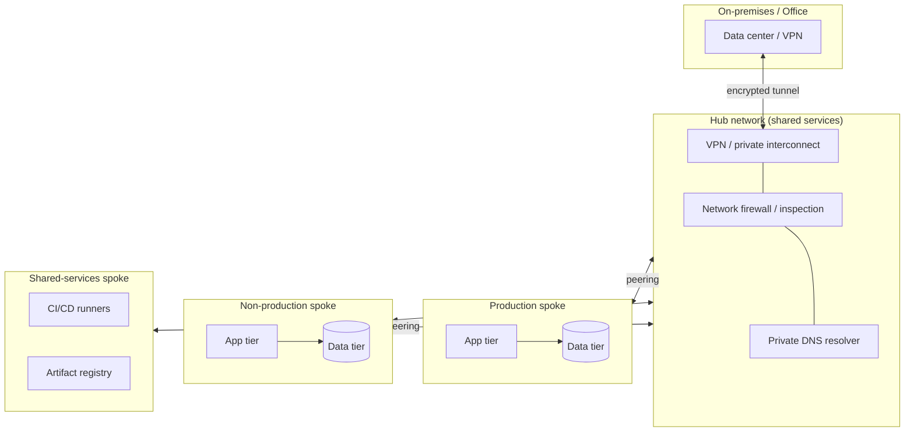
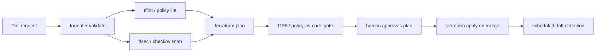

A landing zone is the deterministic substrate every later cloud decision inherits. Get the account structure, identity model, network topology, and guardrails right once, and everything you deploy afterward lands into a known-good, auditable place. Get them wrong, and you spend the next two years retrofitting policy onto workloads that already learned the bad habits. This guide is the reference architecture we hold our own delivery to when we stand up a foundation for a small or mid-market client across Amazon Web Services (AWS), Microsoft Azure, and Google Cloud Platform (GCP).

The through-line is the BASH doctrine: the foundation is code, not click-ops. Every control is expressed in infrastructure as code (IaC), version-controlled, reviewed, and applied through a pipeline. Artificial intelligence (AI) belongs in this stack — for drift summaries, policy authoring, and code review — but it is an overlay on a deterministic base, never the load-bearing wall. A landing zone you cannot reproduce from a git commit is not a landing zone; it is an outage waiting for a maintenance window.

## What a landing zone actually is

Strip away the branding and a landing zone is four decisions, made once, at the level above any individual workload:

- **A tenancy hierarchy** — how you carve the provider's top-level account/subscription/project boundaries so that blast radius, billing, and policy have natural seams.
- **An identity plane** — who can assume what, from where, proven by a single source of identity rather than a sprawl of local credentials.
- **A network topology** — how traffic flows between environments and to on-premises, and what is reachable from the public internet (ideally very little).
- **A guardrail layer** — the preventive and detective controls that make the wrong thing hard to do and the right thing the path of least resistance.

Each hyperscaler ships an opinionated take on this. AWS documents the [AWS Well-Architected Framework](https://docs.aws.amazon.com/wellarchitected/latest/framework/welcome.html) and packages the landing-zone pattern as Control Tower plus Organizations. Microsoft publishes the [Azure landing zones conceptual architecture](https://learn.microsoft.com/en-us/azure/cloud-adoption-framework/ready/landing-zone/) as part of its Cloud Adoption Framework. Google frames the same problem through the [Google Cloud Architecture Framework](https://cloud.google.com/architecture/framework) and its enterprise foundations blueprint. The vocabulary differs; the shape does not. What follows maps the common structure onto all three so you can reason across a client's mixed estate.

## Tenancy hierarchy: accounts, subscriptions, projects

The single most consequential landing-zone decision is where you draw account boundaries, because that boundary is your hardest security and billing edge. A resource in a separate AWS account cannot touch a resource in another account unless you explicitly cross that seam; the same is true for Azure subscriptions and GCP projects. Use that.

The provider-neutral pattern is a management/organization root with organizational units (OUs) or folders beneath it, and workload isolation units at the leaves:

| Concept | AWS | Azure | GCP |
| --- | --- | --- | --- |
| Root | Organization management account | Root management group / tenant | Organization node |
| Grouping tier | Organizational unit (OU) | Management group | Folder |
| Isolation unit | Account | Subscription | Project |
| Preventive policy | Service control policy (SCP) | Azure Policy + management group | Organization policy constraint |

A sound default hierarchy for a mid-market client looks like this: a dedicated management account/subscription/project that holds nothing but organization configuration; a security OU/folder for log archive and audit tooling; a shared-services OU for the hub network, DNS, and CI/CD runners; and then a set of workload OUs split by environment (production, non-production, sandbox). Give every workload its own isolation unit per environment. The temptation to put dev and prod in one account "to save on setup" is exactly the shortcut that produces a bad afternoon later — one fat-fingered policy or a leaked key crosses an environment boundary that should never have existed.

For an SMB with two applications this may be six to ten accounts; for a mid-market firm, thirty is unremarkable. That is fine. Accounts are free; the isolation they buy is not something you can replicate with tags after the fact.

## Identity and access: one source of truth

Local users in each account are a liability that compounds with every account you add. The landing-zone answer is federation: a single identity provider (IdP) — Entra ID, Okta, or Google Workspace — is the source of truth, and every cloud account grants access by assuming a role mapped to a group in that IdP. Nobody holds long-lived credentials in a workload account; they authenticate once and assume short-lived, scoped roles.

The concrete mechanisms per provider:

- **AWS** — IAM Identity Center (the successor to AWS SSO) federates your IdP to permission sets that resolve to IAM roles per account. Workloads use IAM roles; humans get temporary credentials via single sign-on (SSO). Avoid IAM users entirely except for a break-glass path.
- **Azure** — Entra ID is the IdP natively. Grant access with role-based access control (RBAC) at the management-group or subscription scope, and gate privileged roles behind Privileged Identity Management (PIM) for just-in-time elevation.
- **GCP** — Cloud Identity or Workspace federates to IAM. Prefer groups over individual bindings, and use service accounts with workload identity federation rather than downloaded service-account keys, which are a recurring exfiltration vector.

Three rules survive contact with every real environment. First, least privilege is a starting posture, not a cleanup task — grant the narrow role and widen only on evidence. Second, keep exactly one break-glass account per cloud, with a long random credential in a physical safe, multi-factor authentication (MFA) required, and its every use alarmed. Third, human access should be time-bound and just-in-time wherever the platform supports it; standing admin is the credential an attacker most wants. Identity is where the landing zone meets the wider control set covered in [[Security architecture for small business]] — the two are authored together, not in sequence.

## Network topology: hub-spoke and private connectivity

The default network posture is: nothing is public unless there is a written reason, and traffic between environments flows through a controlled point. The pattern that delivers this across all three clouds is hub-spoke.

A central hub network hosts the shared egress, inspection, and hybrid-connectivity components — a network firewall, DNS resolvers, and the gateway back to on-premises. Each workload lives in its own spoke network, peered to the hub but not to its siblings. East-west traffic that must cross environments is forced through the hub, where it can be inspected and logged; a compromised spoke cannot pivot laterally into another.



The provider mechanics differ in the details. On AWS the hub is typically a Transit Gateway with a central inspection Virtual Private Cloud (VPC) running AWS Network Firewall; spokes are VPCs attached to the Transit Gateway. Azure implements this as a hub virtual network (VNet) with Azure Firewall and either VNet peering or the managed Virtual WAN, with spoke VNets peered in. GCP uses a Shared VPC — a host project owns the network and service projects attach to it — often paired with Network Connectivity Center for hybrid reach.

Two practices keep this topology honest. Reach cloud services over private endpoints (AWS PrivateLink, Azure Private Link, GCP Private Service Connect) rather than public service URLs, so your data-plane traffic never traverses the internet. And centralize domain name system (DNS) resolution in the hub so private names resolve consistently and split-horizon resolution against on-premises works. This private-first stance is also what makes the integration patterns in [[Integration architecture: APIs, events, legacy]] safe to run — an event bus or API gateway that is reachable only from inside the topology is a fundamentally smaller attack surface.

## Guardrails: preventive and detective controls

Guardrails are the difference between a landing zone and a pile of accounts. The goal is a set of controls that make undesirable actions structurally impossible or immediately visible, applied at the hierarchy level so they inherit down to every workload automatically.

**Preventive guardrails** stop the action before it happens. Author them at the OU/management-group/folder scope:

- **AWS** — service control policies (SCPs) at the OU level. Deny disabling of CloudTrail, deny use of regions you do not operate in, deny public Simple Storage Service (S3) access, deny root-user actions. SCPs are guardrails, not grants — they cap the maximum permission, and IAM still grants within that cap.
- **Azure** — Azure Policy definitions assigned at the management group, with `Deny` and `DeployIfNotExists` effects. Enforce allowed regions, required tags, and encryption; auto-remediate missing diagnostic settings.
- **GCP** — organization policy constraints (for example, `constraints/compute.requireOsLogin`, `constraints/iam.disableServiceAccountKeyCreation`, restrict resource locations) applied at the organization or folder node.

**Detective guardrails** catch what prevention cannot and feed a central log archive. Turn on the org-wide audit trail — AWS CloudTrail, Azure Activity Log plus diagnostic settings, GCP Cloud Audit Logs — and ship every account's logs to a single, append-only, cross-account log archive that even administrators of the source account cannot alter. Layer on the managed posture and threat services (AWS Security Hub and GuardDuty, Microsoft Defender for Cloud, Google Security Command Center) so misconfiguration and anomalous behavior surface without a human writing every rule.

Two guardrails are non-negotiable and constantly under-implemented. **Tagging/labeling policy** must be enforced, not requested — a resource without an owner, environment, and cost-center tag should fail to deploy, because untagged resources are the ones nobody dares delete and nobody can bill. **Cost guardrails** — account-level budgets with alert thresholds, plus anomaly detection — belong in the landing zone from day one; the classic failure mode is a non-production account quietly running a large instance for months because no budget alert ever fired. AWS documents the account and guardrail model in its [organizing your environment guidance](https://docs.aws.amazon.com/whitepapers/latest/organizing-your-aws-environment/organizing-your-aws-environment.html); the principle is identical on Azure and GCP.

## Infrastructure as code: Terraform versus native

Everything above is expressed as code. The first real decision is which tool.

**Terraform** (or the Terraform-compatible OpenTofu) is the pragmatic default for a client with a mixed or potentially-mixed estate. One tool, one language (HashiCorp Configuration Language), one mental model spans AWS, Azure, GCP, and the hundreds of software-as-a-service (SaaS) providers with a Terraform provider. That portability is real and it is the reason most multi-cloud shops standardize on it. HashiCorp documents the [recommended module and workflow patterns](https://developer.hashicorp.com/terraform/language/modules/develop) directly.

**Native IaC** — AWS CloudFormation (or the AWS Cloud Development Kit atop it), Azure Bicep (which compiles to Azure Resource Manager templates), and GCP's Infrastructure Manager (its predecessor, Deployment Manager, reached end of support in March 2026, and Infrastructure Manager runs Terraform under the hood, so Google Cloud has no first-party template language directly analogous to CloudFormation or Bicep) — trades portability for tightness of fit. Native tools often expose new provider features on day one, integrate with the provider's own drift detection and rollback, and require no separate state store because the provider tracks state for you. If a client is committed to a single cloud and values that first-party integration, native is a defensible choice.

The decision criteria that actually matter:

| Question | Lean Terraform / OpenTofu | Lean native (CloudFormation / Bicep) |
| --- | --- | --- |
| One cloud or several? | Two or more, now or likely | Committed to exactly one |
| Do you provision SaaS/DNS/identity too? | Yes — one tool for all of it | No — cloud resources only |
| Who maintains it? | A team fluent in Terraform | A team already deep in one provider |
| Day-one access to new features? | Acceptable to wait for the provider | Must have it immediately |
| State store you must run? | Yes — you own the backend | No — provider manages state |

There is no universally right answer, and mixing is legitimate — Terraform for the cross-cutting landing zone, Bicep or CloudFormation for a team that lives entirely in one cloud. What is not legitimate is click-ops. A control created in a console is invisible to review, undocumented, and gone the day the person who made it forgets they did.

## Module and state strategy

The two failure modes that sink IaC programs are a monolithic root module and careless state management. Both are avoidable.

**Modules.** Compose from small, single-purpose modules — a network module, an account-baseline module, a workload module — each versioned and consumed by reference, not copy-paste. A root configuration per environment wires the modules together with environment-specific inputs. The anti-pattern is one enormous root module that provisions the entire estate: any change plans the whole world, blast radius is total, and two engineers cannot work in parallel without colliding.

**State.** Terraform state is sensitive — it can contain secrets in plaintext — and it is the source of truth for what exists. Treat it accordingly:

- **Remote backend, always.** S3 with DynamoDB locking, an Azure Storage account, or a GCS bucket. Never local state, never state in git.
- **Encrypt at rest and restrict access** to the state bucket as tightly as any production database.
- **Enable state locking** so two concurrent applies cannot corrupt state.
- **Segment state by boundary.** One state file per environment per component, not one global state. Small blast radius, faster plans, parallel work.

The reference layout below shows the seam: shared modules on the left, thin per-environment roots on the right, each root pinned to a module version and pointing at its own isolated state.

```hcl
# modules/network/main.tf  — reusable, versioned, no environment specifics
variable "cidr_block" { type = string }
variable "environment" { type = string }

resource "aws_vpc" "spoke" {
  cidr_block = var.cidr_block
  tags = {
    Name        = "spoke-${var.environment}"
    environment = var.environment
    managed_by  = "terraform"
  }
}

# environments/prod/main.tf  — thin root, pins module version, own state
terraform {
  backend "s3" {
    bucket         = "acme-tfstate-prod"
    key            = "network/terraform.tfstate"
    dynamodb_table = "acme-tf-locks"
    encrypt        = true
  }
}

module "network" {
  source      = "git::https://example.com/iac//modules/network?ref=v1.4.0"
  cidr_block  = "10.20.0.0/16"
  environment = "prod"
}
```

Pinning the module to a git tag (`ref=v1.4.0`) is what makes the environment reproducible: prod and non-prod can run different, known versions, and an upgrade is a reviewed pull request that bumps one line, not an untracked drift.

## CI/CD for infrastructure

The pipeline is what turns IaC from a good intention into an enforced control. The non-negotiable rule: **no human runs `apply` from a laptop against production.** Changes land through a pipeline that a machine identity executes, with a human approving the plan, not typing the command.

A sound infrastructure pipeline runs these stages on every pull request:



The load-bearing stages: `plan` on the pull request so reviewers see the exact diff before it merges; a static security scan (tfsec, Checkov, or the provider's own) to catch a public bucket or an open security group before it exists; and a policy-as-code gate — Open Policy Agent (OPA) / Conftest or Sentinel — that mechanically rejects a plan violating your rules (no unencrypted volumes, no untagged resources, no disallowed regions). Authenticate the pipeline to the cloud with short-lived federated credentials via OpenID Connect (OIDC), never a stored access key, so there is no long-lived secret to leak.

Add a scheduled drift-detection run. State says what should exist; the cloud says what does. When they diverge — someone made an emergency console change at 2 a.m. — you want to know within a day, not discover it during the next unrelated deployment. This is also the natural place for an AI overlay that earns its keep: summarizing a noisy `terraform plan`, drafting a module from a specification, or explaining why a policy gate failed. It reviews and accelerates; the deterministic pipeline still decides. That ordering — humans and machines proposing, a reproducible pipeline enforcing — is the whole doctrine in one workflow.

## Anti-patterns to refuse

A short list of the failures we see most, so you can name them before they take root:

- **Click-ops foundations.** Any control created in a console is undocumented and unreproducible. If it matters, it is in code.
- **One giant account.** Dev, staging, and prod sharing a single account/subscription/project. No account boundary means no real isolation, no matter how many tags you add.
- **Long-lived credentials.** Stored access keys, downloaded service-account keys, IAM users for automation. Every one is a standing exfiltration target. Use federation and short-lived tokens.
- **Global Terraform state.** One state file for the whole estate. Total blast radius, glacial plans, no parallel work.
- **Guardrails as documentation.** A wiki page that says "please tag your resources" is not a guardrail. If the rule matters, a policy enforces it and a non-compliant deploy fails.
- **Public by default.** Resources reachable from the internet because that was the quickest way to make them work. Private endpoints and a deny-public preventive policy make the safe path the default path.

## Your next step

A landing zone is worth building once, correctly, before the workloads arrive — retrofitting isolation and guardrails onto a live estate is several times the effort and carries real outage risk. If you are standing up a cloud foundation for a client, or inheriting one that grew without a plan, our [[Cloud architecture]] work is the reference architecture and hands-on delivery behind everything in this guide. [Start a conversation about your environment](/contact/) and we will map the account structure, identity model, and IaC strategy to what you are actually building.
