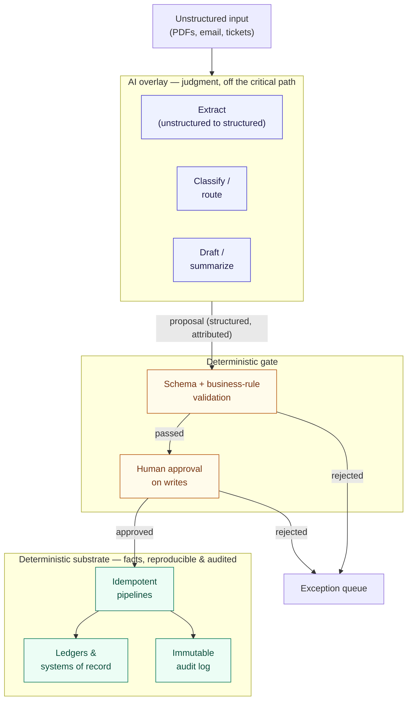

Every consulting practice has a bias baked into how it builds. Ours is a single sentence: **a fact should never depend on a probability.** If a step produces a value that other steps, ledgers, or people will trust as true — a posted journal entry, a provisioned resource, a reconciled balance, a routed payment — that step must be deterministic, reproducible, and auditable. The moment you make such a step depend on a sampled token from a large language model, you have traded a system you can prove for one you can only hope about.

This is the deterministic-first doctrine. It is not anti-artificial-intelligence (AI). We ship AI in production constantly. It is a discipline about *where* AI is allowed to sit relative to the critical path of a fact. AI belongs as an overlay — it classifies, drafts, extracts, and proposes — but the load-bearing wall underneath it is ordinary, boring, testable code. This document argues the position rigorously and shows how to draw the line through a real client process.

## What "deterministic" buys you that a model cannot

Determinism is not a virtue in the abstract. It is the property that makes four other properties achievable, and each one maps to something a business or auditor actually needs.

**Reproducibility.** Given the same inputs and the same code version, a deterministic function returns the same output every time. You can re-run last quarter's close, replay a failed batch, or reconstruct exactly what the system did on a specific date. A model with a non-zero temperature cannot promise this, and even at temperature zero, provider-side changes to weights, tokenizers, or serving stacks mean you have no contractual guarantee the same prompt yields the same completion next month. That is fine for a draft. It is disqualifying for a number someone signs.

**Auditability.** A deterministic pipeline has an explainable chain from input to output: this row entered, this rule fired, this value resulted. You can point an auditor at the transformation and they can follow it. The reasoning of a large language model is not available for inspection in this way — a post-hoc "explanation" it generates is itself another probabilistic output, not a faithful trace of the computation. When the framework behind a control asks you to demonstrate that a process operates as designed, deterministic logic answers the question and a model does not.

**Cost and latency predictability.** A script that transforms ten thousand rows costs the same whether it runs today or after a pricing change, and its latency is a function of your own infrastructure. Routing those same ten thousand rows through a model means per-token cost, rate limits, retries, and tail latencies you do not control. Putting a model on a high-volume critical path is often the single largest and least predictable line item in a system's run cost.

**Bounded failure modes.** Deterministic code fails in ways you can enumerate and test: a null where you expected a value, a schema mismatch, a division by zero. Probabilistic systems add failure modes with no clean boundary — confident fabrication, silent drift as inputs shift out of distribution, prompt injection, and sensitivity to phrasing that no test suite fully covers. You can guardrail these, and we do, but you cannot eliminate the category the way you can eliminate a class of bug in deterministic code.

None of this is an argument that models are unreliable in general. It is an argument about *placement*. The same model that is dangerous as the sole authority for a posted balance is genuinely excellent at reading a messy supplier PDF and proposing the line items for a human to confirm.

## The substrate-and-overlay model

The mental model we build against has two layers. The **deterministic substrate** is everything that must be true, reproducible, and auditable: the pipelines, the state stores, the idempotent write operations, the validation rules, the ledgers of record. The **AI overlay** sits above it and does the work that genuinely requires judgment over unstructured or ambiguous input: extraction, classification, drafting, summarization, semantic retrieval, ranking.

The critical rule is the boundary between them. **The overlay never writes a fact directly.** It produces a *proposal* — structured, validated, and attributed — and that proposal enters the deterministic substrate only through the same audited, human-gated write path that any other input would use. The model's output is treated as untrusted user input, because architecturally that is exactly what it is.



Read the diagram as a one-way valve. Unstructured input flows up into the overlay, which is free to be as clever as it likes because nothing it produces is trusted yet. Everything then funnels through a deterministic gate — schema and business-rule validation first, then a human approval step for anything that writes — before it is allowed to touch a ledger or system of record. The substrate at the bottom is where facts live, and it only ever accepts inputs that have passed the gate.

## Drawing the line through a real process

The doctrine becomes concrete when you take a client workflow and sort each step into substrate or overlay. Consider accounts-payable invoice processing at a mid-sized distributor.

| Step | Layer | Why |
| --- | --- | --- |
| Receive the invoice PDF | Substrate (ingest) | Deterministic capture, hashed, stored immutably |
| Read the vendor, amount, line items, dates | **Overlay** | Genuine judgment over messy, varied layouts — a model excels here |
| Validate against the purchase order and receipt | Substrate | A rule engine matches quantities and totals; pass/fail is not a judgment call |
| Flag anomalies (duplicate, price variance) | Substrate + overlay | Deterministic checks for the known rules; a model can *suggest* unusual patterns for review |
| Approve the payment | Substrate (human-gated) | A person owns the write; the model never approves |
| Post to the ledger | Substrate | Idempotent, keyed on invoice ID, fully reproducible |

The extraction step is where the model earns its place — turning an unpredictable PDF into structured fields is exactly the ambiguous, unstructured work deterministic code is bad at. Everything downstream of extraction is a fact, so everything downstream is deterministic. The model proposes the fields; the rule engine and a human decide whether they become truth.

The heuristic that draws the line is a single question asked at every step: **would a wrong answer here become a fact that something downstream trusts without further review?** If yes, the step is substrate, and if a model is involved at all, its output must pass validation and a human gate before it is committed. If no — the output is a draft, a suggestion, a ranking that a person will look at anyway — the overlay can own it outright.

## Idempotency: the substrate's non-negotiable property

Reproducibility is worth little if re-running a step corrupts state. That is why every write in the substrate is designed to be **idempotent** — applying it once and applying it five times leave the system in the same correct state. Idempotency is what lets you retry a failed batch without fear, replay events after an outage, and reconcile without double-posting.

In practice this means writes are keyed on a stable natural or synthetic identifier and use conditional or upsert semantics rather than blind inserts. A payment is keyed on its invoice identifier; a provisioned resource is declared, not imperatively created twice. The standard SQL pattern is an upsert with an explicit conflict target:

```sql
-- Posting an invoice: safe to re-run, will never double-post
INSERT INTO ledger_entries (invoice_id, vendor_id, amount_cents, posted_at)
VALUES (:invoice_id, :vendor_id, :amount_cents, now())
ON CONFLICT (invoice_id) DO UPDATE
  SET amount_cents = EXCLUDED.amount_cents,
      posted_at    = EXCLUDED.posted_at
WHERE ledger_entries.amount_cents IS DISTINCT FROM EXCLUDED.amount_cents;
```

The same principle governs infrastructure. Declaring a resource in a tool like Terraform and letting it converge to the declared state is idempotent by construction; the equivalent hand-run shell script that creates resources imperatively is not, and it will fail or duplicate on the second run. HashiCorp's own documentation frames this directly, describing Terraform as a way to [define infrastructure as code to manage its full lifecycle](https://developer.hashicorp.com/terraform/intro) — the point being that the declaration, not the sequence of commands, is the source of truth. A message consumer applies the same discipline: process an event, record its identifier as handled, and skip it if it arrives again, so at-least-once delivery becomes effectively exactly-once at the application layer.

Idempotency is precisely the property an AI overlay cannot supply on its own. A model asked to "post this invoice" twice may produce two subtly different results. The substrate makes the operation safe regardless of how many times the overlay proposes it.

## Patterns for the overlay done right

Holding the overlay off the critical path does not mean underusing it. The patterns below get real value from models while keeping the doctrine intact.

- **Extraction with a schema contract.** The model returns structured output constrained to a schema, and the substrate rejects anything that does not conform. The model's job ends at "here are candidate fields"; validation and commitment are deterministic. This is the highest-value, lowest-risk overlay pattern for most businesses.
- **Classification and routing, with a deterministic fallback.** A model triages a ticket or routes a document, but low-confidence cases fall through to a rules-based default or a human queue. The model improves throughput on the easy majority; it never silently mishandles the hard minority.
- **Drafting for human completion.** Proposals, replies, summaries, first-pass code — the model writes a draft that a person edits and owns. Because a human is the committing authority, this pattern needs the least machinery.
- **Retrieval that grounds, not decides.** In a retrieval-augmented setup, deterministic retrieval fetches the source passages and the model composes an answer *with citations back to those passages*, so a reviewer can check the claim against its source. The retrieval index and the source documents are substrate; the composition is overlay. We treat the failure modes and evaluation of these systems as a discipline of their own in [[Production AI: RAG, agents, guardrails, and evals]].

The anti-patterns are the mirror image. An agent that writes to a production database with no human gate; a model whose free-text output is parsed and posted without schema validation; a "let the model decide" branch on the critical path with no deterministic fallback; a workflow where the only record of *why* something happened is a prompt and a completion. Each of these puts a probability where a fact belongs.

## How the split maps to controls and evidence

The doctrine is not only an engineering preference — it is what makes a system *auditable*, which is often the difference between an automation a business can rely on and one its accountants or regulators will reject.

Under a controls framework, a control is something you can demonstrate operates as designed and produces evidence. Deterministic substrate steps generate that evidence natively. The validation rule that fires, the identity of the human who approved a write, the immutable log entry with a timestamp and a version — these are the artifacts an assessor asks for. When a step is deterministic and human-gated, you can show separation of duties (the model proposes, a person disposes), completeness (every input is accounted for in the log), and reproducibility (the transformation can be re-run to the same result). This is exactly the machinery a finance close depends on, which is why [[Record-to-report automation and controls]] is built substrate-first, with AI confined to classification and reconciliation *suggestions* that a controller confirms.

For the overlay, the evidence is different in kind. You cannot audit a model's internal reasoning, so you audit its *boundary*: the schema it must conform to, the validation it must pass, the human who signed off, and the offline evaluations that measure its proposal quality over time. The National Institute of Standards and Technology frames this discipline in its [AI Risk Management Framework](https://www.nist.gov/itl/ai-risk-management-framework), which organizes the work into governing, mapping, measuring, and managing AI risk. The doctrine's contribution is to make that job tractable: because the overlay never commits a fact unilaterally, the blast radius of a bad proposal is bounded by the gate, and the evidence you need is the record of the gate doing its job.

The practical upshot is a clean division of assurance. The substrate is assured by testing, reproducibility, and immutable logs. The overlay is assured by its schema contract, its validation gate, its human approver, and its evaluation harness. Neither depends on trusting a probability, because the probability never reaches the ledger unescorted.

## Where this leaves you

Deterministic-first is not caution for its own sake. It is the architecture that lets us hand a small or medium business enterprise-grade automation they can actually trust — reproducible under audit, predictable in cost, bounded in failure — while still capturing the real leverage that models provide on the messy, unstructured work at the edges.

If you are designing a system and cannot tell whether a step belongs in the substrate or the overlay, apply the one question: would a wrong answer here become a trusted fact? Sort every step by that answer, put a validation-and-approval gate on the boundary, and make every substrate write idempotent. The result is a system where AI is a genuine force multiplier and never a single point of unexplained failure.

When you want that boundary designed into a real workflow rather than bolted on afterward, our [[AI solutions and intelligent automation]] practice builds the overlay and the substrate together, with the gate and the evidence trail in place from day one. [Start a conversation](/contact/) and we will map the line through your process with you.
