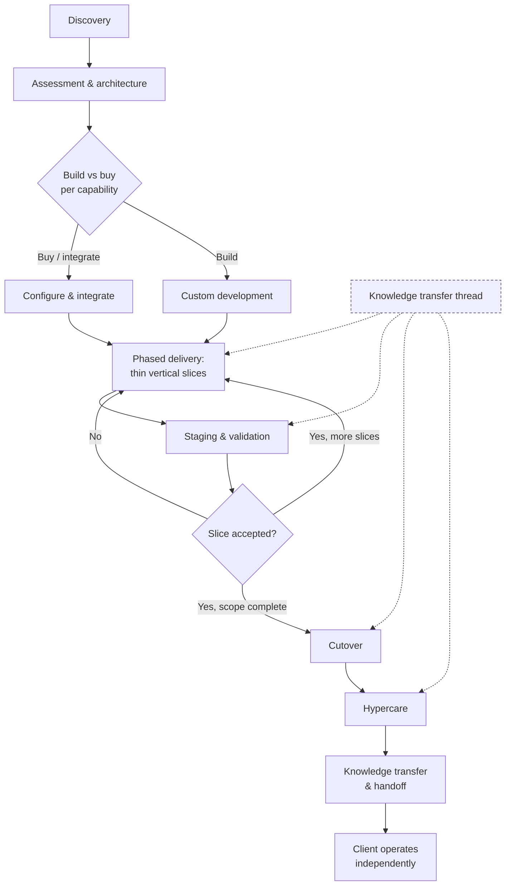

A methodology is not a document you hand a client. It is the set of default moves a consultant makes when the situation is ambiguous — the questions asked first, the artifacts produced before code, the sequence that keeps a project from collapsing into either analysis paralysis or a big-bang rewrite. This is the method a BASH consultant follows end to end, and the reasoning behind each phase.

The method exists to serve one hard constraint that most consulting frameworks ignore: our client is a small or medium business, not an enterprise with a program-management office and a bench of internal engineers. There is no one on the other side to absorb a 200-page requirements binder or to maintain a bespoke platform after we leave. So every phase is built to produce something the client can operate, audit, and own — and to work the firm out of a job. The goal of the engagement is a system that outlives the engagement.

Two doctrines shape every phase and are worth reading alongside this guide. [[The deterministic-first doctrine]] explains why we build auditable, scriptable foundations before we reach for a model — the discovery, architecture, and cutover choices below all fall out of it. [[Running an AI-native consulting practice]] explains how we use AI internally to move faster without letting it become the thing that breaks at 2 a.m. This method is where both meet the client.

## Mission: people over profits

The method exists to correct a specific unfairness. The systems that decide whether a business thrives — real accounting, integrated operations, resilient infrastructure, defensible security — were built for enterprises and priced, staffed, and gatekept accordingly. The small and medium businesses that employ most people and hold up most communities are left to make do with spreadsheets and hope, or to sign a lock-in contract they cannot read and cannot leave. Everything below is what it looks like to refuse that trade.

People over profits is not a slogan here; it is a set of decisions that cost us money on purpose.

- **We measure success by the client's independence, not by how long they need us.** The engagement ends with a client who can run and evolve the system without us — the opposite of a business model that depends on customers never learning.
- **We refuse manufactured dependency.** Accounts, domains, data, and code are registered to and owned by the client. There is no proprietary corner engineered to force a call back to us. If the honest answer to "what happens if BASH disappears" is "the client is fine," we did it right.
- **We build what the client can inspect and own.** This is the same conviction behind the founder's open-education work at [it-journey.dev](https://it-journey.dev/about/): technology should be learnable and ownable by anyone curious enough to try, and a tool you cannot inspect is a tool you cannot truly own. It is why every deliverable is auditable, documented, and handed over rather than hidden.
- **We meet the business where it is.** A three-person firm and a 150-person distributor get the same respect and the same honesty, sized to their reality — not an enterprise pattern imposed because it is what the last engagement happened to use.

None of this is charity. A partner who increases a client's self-sufficiency earns trust, referrals, and the kind of long relationship a client chooses rather than one they are trapped in. Doing right by the people is the durable business, not a tax on it. That is the mission the rest of this method serves.

## The principles we adapt

BASH does not invent methodology from scratch. It adapts a small set of well-worn engineering and learning principles — many of them articulated in the open at [it-journey.dev](https://it-journey.dev/about/) — and bends each one to the reality of a small business that has no program-management office and no bench of engineers to absorb complexity. The adaptation is the whole point: the same principle looks different when the client has to own the result.

- **Design for failure (DFF).** Assume the migration will surface data nobody admitted was dirty, the integration will break, and the go-live will find a workflow the operators quietly reject. So the riskiest slice goes first, where failure is cheap, and rollback plans and reconciliation checks are defaults, not afterthoughts. The small-business adaptation is that failure has to be recoverable by the client, not only by us.
- **Keep it simple (KIS).** Clarity over cleverness, every time. The boring, inspectable solution a client can operate beats the elegant one only we understand — which is why buy-or-integrate is the default and custom code is a liability chosen deliberately. Simplicity is measured by what the client can maintain after we leave, not by what impresses another engineer.
- **Don't repeat yourself (DRY), applied where it belongs.** One system of record per entity, scripted and versioned pipelines instead of copy-paste, configuration over duplication. The deliberate exception is people: we repeat training on purpose, because repetition is how competence is built. DRY governs the architecture, never the teaching.
- **Release early and often (REnO).** Thin vertical slices put working software in front of the people who will use it early and continuously, so trust is built on results and mistakes are caught while they are cheap. For an SMB, "release" means into the hands of the operators, not into a demo environment they never touch.
- **Minimum viable product (MVP).** Build the smallest slice that delivers real value, then iterate. Here the discipline cuts the opposite way from enterprise habit: the risk is rarely shipping too little — it is gold-plating a system the client cannot afford to maintain.
- **Collaboration and open source (COLAB).** Prefer open, portable, standards-based tools; keep the client's data and code in a repository they own; favor shared review over lone-genius work. Open where possible is both an engineering choice and an ownership choice, and it is what makes the handoff real.
- **AI-powered development (AIPD).** Artificial intelligence (AI) is a collaborator, not an oracle — confidently wrong often enough that blind trust is a liability. We use it to move faster internally and in delivery, always behind human review and a deterministic gate. The full treatment lives in [[The deterministic-first doctrine]] and [[Running an AI-native consulting practice]].
- **Start where you are; progress over perfection.** Discovery meets a client at their actual maturity — the surviving, stable, and scaling ladder in [[The small-business IT foundation]] — and the goal is to move them one solid rung, not to impose a target sized for an enterprise. Improvement is the permanent state, not a finish line, which is the same posture behind a phased [[Building a 12-month IT roadmap]].

Read together, these are not wall posters; they are the reasons the phases below take the shape they do. A method that produces systems a small business can own has to rest on principles that put the person living with the result first.

## The shape of an engagement

Four phases, run mostly in sequence but with deliberate overlap: discovery, assessment and architecture, phased delivery, and knowledge transfer. The diagram below is the lifecycle we default to. It is not a waterfall — each delivery slice loops back through a thin architecture and validation step, and knowledge transfer is a thread woven through delivery, not a phase bolted on at the end.

The rest of this guide walks each phase, the artifacts it produces, and the trade-offs a consultant is expected to reason about rather than follow by rote.

## Discovery: inventory before opinion

Discovery is disciplined listening. The failure mode here is arriving with a solution — pattern-matching a new client onto the last engagement and prescribing before you understand. The discipline is to produce three inventories and one map before you form an architectural opinion.

**Systems inventory.** Every system the business depends on, with the same columns whether the client has five staff or 150: what it does, who owns the login and the vendor relationship, what it costs and when it renews, how data gets in and out, and its condition (healthy, aging, at-risk). The interesting rows are the ones nobody volunteers — the spreadsheet that runs commissions, the Access database from 2011, the personal-account subscription paying for a critical tool. The [[The small-business IT foundation]] guide covers the baseline every one of these systems should meet.

**Data inventory.** Where the authoritative copy of each important entity lives — customer, order, invoice, inventory item, employee. In most small businesses no one has ever answered "which system owns the customer's address" and the honest answer is "three of them, and they disagree." Naming the system of record per entity is the single most valuable artifact discovery produces, because every integration and every migration decision downstream depends on it. If the data is duplicated and drifting, note it; you are documenting the current state, not fixing it yet.

**Goals inventory.** What the business is actually trying to do — grow into a second location, survive an audit, cut the monthly close from three weeks to five days, stop losing a half-day a week to re-keying. Each pain point gets tied to a business consequence: revenue, cost, risk, or time. A pain with no consequence is a preference, and preferences do not earn a place on a roadmap.

**Stakeholder map.** Who decides, who pays, who operates the system daily, and who can quietly kill the project by not adopting it. The owner who signs the contract is rarely the person whose workflow you are about to change. Map the champion, the economic buyer, the daily operators, and the skeptics — and plan to spend real time with the operators, because a technically perfect system that the front desk refuses to use is a failed engagement.

Discovery output is a short, honest current-state document and a prioritized problem list. It is deliberately not a solution. Resist the client's understandable pull toward "so what should we buy" until the map is complete.

## Assessment and architecture: design the target state, decide build versus buy

With the current state mapped, you design the target state and the path to it. This is where the deterministic-first doctrine does its heaviest work.

### Target-state design

Sketch the destination architecture at the level of systems and data flows, not products. What is the system of record for each entity in the target state? Where does data move, in which direction, how often, and who owns each field? What is deterministic pipeline versus human judgment versus — only where it genuinely earns its place — an AI overlay? Draw the boundaries before you name a single vendor. A target-state diagram that a client's operations lead can read and correct is worth more than a polished slide they nod at and do not understand.

The doctrine here is explicit: the load-bearing wall is deterministic. Data movement, financial calculations, access control, backups, and anything an auditor will ask about are built as scripted, versioned, reproducible pipelines. AI is an overlay for the places that are genuinely fuzzy — classification, drafting, extraction from unstructured input, triage — and always behind a deterministic check. If a capability can be a script, it is a script. This is not conservatism for its own sake; it is what makes a system a client can own, test, and trust after you leave.

### Build versus buy, per capability

Decide build-versus-buy one capability at a time, not for the whole system. The default is buy or integrate a well-supported product; custom code is a liability you are choosing to maintain, and for a small business that maintenance burden usually lands back on you or on nobody. Reach for custom build only when the capability is a genuine differentiator, no product fits without contortion, or the integration glue between bought systems is itself the work.

A workable decision frame:

| Signal | Lean buy / integrate | Lean build |
| --- | --- | --- |
| Is this a differentiator or a commodity? | Commodity (email, accounting, storage) | Core to how the business competes |
| Does a mature product fit? | Yes, with reasonable configuration | Only with heavy customization that fights the tool |
| Volume and timing | Standard business volume | Extreme volume or hard real-time needs |
| Who maintains it after handoff | Vendor maintains the platform | Client can realistically own a small, documented codebase |
| Data portability | Clean export in standard formats | You control the schema outright |

Portability is a first-class criterion, not a footnote. Before recommending any product, confirm the client can get their data out in a standard format and that accounts are registered to the business, not to a vendor. Lock-in you sign up for in month one is the most expensive line item in year three.

### Risk register

Every engagement gets a living risk register from this phase forward: data-loss risks in migration, cutover risks, single points of failure, key-person dependencies, vendor and lock-in risks, security exposures, and adoption risk. Each risk gets an owner, a likelihood-and-impact rating, and a mitigation. The register is not a compliance artifact you write once; it is reviewed at every phase gate and it directly shapes sequencing — the highest-risk items get the earliest, thinnest slices so failures surface while they are cheap.

Anchor the security portion of the register to a recognized control set rather than inventing your own. The [CIS Critical Security Controls](https://www.cisecurity.org/controls) give an implementation-ordered baseline that maps cleanly onto small-business reality, and the [NIST Cybersecurity Framework](https://www.nist.gov/cyberframework) gives the organizing functions to talk to non-technical stakeholders. [[Security architecture for small business]] goes deep on applying these at SMB scale.

## Scoping and estimation: ranges, not false precision

Scoping happens at the boundary between architecture and delivery, and honesty here is a professional obligation. You do not know enough at proposal time to give a single-number estimate, and pretending you do sets up the client to feel deceived and you to eat the overrun.

Estimate in ranges tied to explicitly stated assumptions. "Discovery and architecture, typically two to four weeks." "The first delivery slice, roughly four to eight weeks depending on how clean the source data turns out to be." State the assumptions that would move the range — data quality, availability of client subject-matter experts, how many third-party systems have usable interfaces — because those are exactly the variables that blow up fixed bids. Where a client needs a firmer number, scope a small paid discovery as its own deliverable, then estimate the build with real information. A range backed by named assumptions is more trustworthy, and more accurate, than a precise number backed by a guess.

Guard scope with a written change process. New requests are welcome; they are logged, sized against the range, and either accepted into scope with adjusted time or parked for a later phase. The change log lives next to the risk register, and both are visible to the client. Scope creep is not caused by clients asking for things — it is caused by unlogged yeses.

## Phased delivery: thin vertical slices

The delivery philosophy is thin vertical slices: end-to-end, production-grade increments that each deliver something the client can actually use, rather than horizontal layers (all the data model, then all the backend, then all the UI) that deliver nothing until the very end. A slice cuts through every layer — data, logic, interface, and the deterministic pipeline underneath — for one narrow, real workflow.

Why vertical, why thin:

- **Risk surfaces early and cheap.** The integration that will fail, the data that is dirtier than anyone admitted, the workflow the operators actually reject — all of it shows up in the first slice, when changing course costs days instead of the whole budget.
- **The client sees real progress, not a status deck.** Trust in an engagement is built by working software in front of the people who will use it, early and often.
- **Adoption is tested continuously.** Each slice puts something in operators' hands, so the gap between "technically works" and "people use it" closes slice by slice instead of exploding at go-live.

Each slice runs through the same short loop: build against a real (masked or sampled) copy of the client's data, deploy to a staging environment that mirrors production, validate with the actual operators, and only then promote. Deterministic components get automated tests and are versioned in source control; the whole environment should be reproducible from configuration, which is the same infrastructure-as-code discipline covered in [[Cloud landing zones and infrastructure as code]]. Where an AI overlay is in a slice, it ships behind a deterministic guardrail and with an evaluation harness, never as an unmonitored black box — the patterns in [[Production AI: RAG, agents, guardrails, and evals]] apply directly.

### Staging and cutover planning

Cutover is where careful engagements still fail, so it is planned as its own deliverable rather than treated as a flip of a switch on the last day. A cutover plan specifies, in writing and rehearsed at least once:

- The exact sequence of steps, with owners and timings, from freeze to go-live.
- A data-migration dry run against production-scale data, with reconciliation counts and checks that prove the migrated data matches the source before anyone trusts it.
- A defined go/no-go checkpoint with named decision-makers and objective criteria.
- A rollback plan — the specific steps to return to the prior system if go/no-go fails — because a cutover you cannot reverse is a bet, not a plan.
- A hypercare window (typically the first one to two weeks post-go-live) with heightened support, a fast triage path, and daily check-ins while the client's team finds the rough edges that only real use exposes.

Prefer parallel runs or phased cutovers over big-bang wherever the domain allows it. Running the new and old systems side by side for a period, or migrating one location or one business unit first, converts a single high-stakes event into a series of smaller, reversible ones. Big-bang is sometimes unavoidable, but it should be a considered choice with an honest risk rating in the register, not a default.

## Change management: the human half of delivery

A system nobody uses is a failed engagement regardless of its technical quality, so adoption is engineered, not hoped for. The stakeholder map from discovery is the input: the operators you identified are involved throughout delivery, not surprised at go-live. Concretely, that means co-designing workflows with the people who will run them, training on the real system during the phased slices rather than in a rushed session at the end, identifying and supporting internal champions, and being candid about what changes and what stays the same for each role. Resistance is usually information — an operator who resists a workflow often understands a constraint the design missed. Treat that as a design input, not an obstacle.

## Knowledge transfer: working the firm out of a job

The defining commitment of the method is that the engagement ends with the client able to run and evolve the system without us. Knowledge transfer is not a closing phase; it is a thread woven through delivery. If it starts at the end, it has already failed.

What working the firm out of a job looks like in practice:

- **Documentation as a build output, not an afterthought.** Architecture diagrams, data-flow maps, runbooks for routine operations, and a plain-language "how this works and what to do when it breaks" guide are produced alongside the system, kept in the client's own repository or knowledge base, and version-controlled with the code.
- **Train the operators and the owner, on their system.** Hands-on training during the phased slices, using the client's real workflows, so competence is built incrementally rather than transferred in one overwhelming session.
- **No manufactured dependencies.** Accounts, domains, and credentials are registered to the business. Code and configuration live in a repository the client owns. There is no proprietary corner that forces a call to us. If the honest answer to "what happens if BASH disappears" is "the client is fine," the handoff was done right.
- **A named internal owner.** Every system needs someone on the client side who owns it. Part of the engagement is identifying that person and building their capability deliberately, so the knowledge does not walk out the door with a single employee.
- **A clean exit and an optional ongoing relationship.** A defined handoff checkpoint marks the client as operationally independent. Any continuing relationship — a retainer, periodic reviews, help with the next phase — is then a choice the client makes because it delivers value, not a dependency we engineered. Ongoing operational support, when the client wants it, is scoped as [[Managed IT services]], not smuggled in through a lock-in.

This is the same principle that runs through [[Building a 12-month IT roadmap]]: a good partner increases a client's self-sufficiency. A firm whose business model depends on clients never learning is not a partner, and it is not the model BASH runs.

## How the doctrine shapes every phase

The deterministic-first, AI-as-overlay doctrine is not a phase — it is the lens on all of them:

- **Discovery** documents what must be deterministic (financial, audit-relevant, security-relevant flows) versus where AI could genuinely help (unstructured input, classification, drafting).
- **Architecture** builds the load-bearing wall from scripted, versioned, reproducible pipelines and confines AI to overlays behind deterministic checks.
- **Delivery** ships deterministic components with automated tests and AI overlays with evaluation harnesses and guardrails, so nothing goes to production unmonitored.
- **Knowledge transfer** is only possible because the foundation is deterministic and auditable — a client can be handed a scripted, documented pipeline and actually own it, in a way they never could own an opaque model at the center of the system.

That last point is the whole argument. Deterministic-first is not caution for its own sake; it is what makes the handoff real. A system whose critical path is auditable and reproducible is a system a small business can inherit. That is the deliverable.

## Where this fits

The engagement method is how BASH delivers every capability in the toolkit, from cloud landing zones to record-to-report automation. If you are weighing how to sequence a body of technology work, get build-versus-buy right per capability, or structure an engagement so the client ends up self-sufficient rather than dependent, that judgment is exactly what [[IT strategy]] work provides. To talk through applying this method to a specific engagement, [start a conversation](/contact/).

## Build at this level

BASH consultants are held to the standard in this guide — and to a higher one still: the ability to build real digital business tools on GitHub with AI, and to show the work in public. The way in is open to anyone and hard to finish, which is exactly the point. That is the qualification for partnering with BASH.

<a href="/tools/partners/qualification/" class="btn btn-primary btn-lg px-4">Easy but Hard</a>
