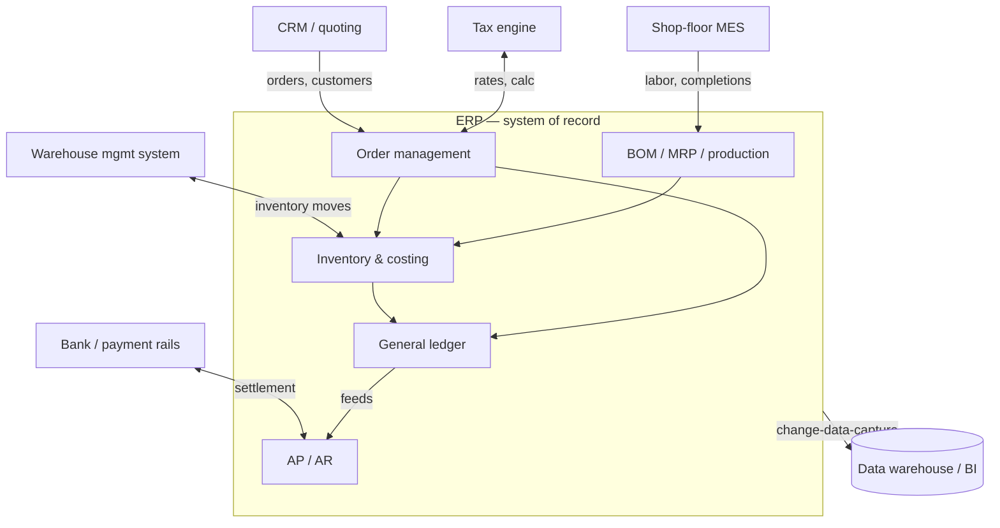
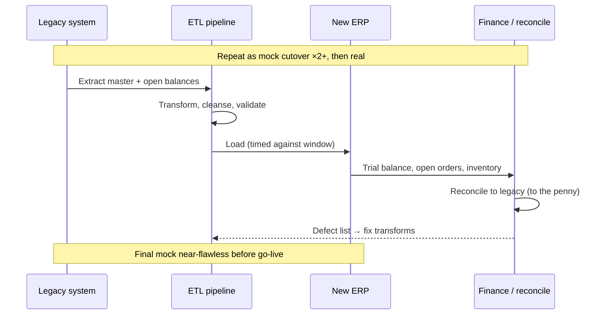

An Enterprise Resource Planning (ERP) implementation for a small or mid-market manufacturer or distributor is not a software installation. It is the act of encoding a business's operating model — how it books revenue, values inventory, plans production, and closes its ledger — into a single transactional system of record. When these projects fail, they rarely fail on the software. They fail on architecture decisions made in the first eight weeks: a chart of accounts that cannot support the reporting the controller needs, master data no one owns, integration boundaries drawn in the wrong place, or a migration that moves twenty years of dirty data into a clean system and calls it done.

This guide is the architectural reference for the decisions that determine whether an ERP goes live clean and stays auditable. It assumes you have implemented before and can read a data model. The through-line is the BASH doctrine: the ERP is a deterministic, auditable foundation, and everything you bolt onto it — automation, analytics, an eventual artificial intelligence (AI) overlay — inherits its integrity or its rot. Get the foundation wrong and no amount of downstream tooling recovers it.

## The system of record, and everything orbiting it

Before any configuration, settle one question: what is the ERP the authoritative source for, and what lives in satellite systems? An ERP for a manufacturer typically owns the general ledger, inventory valuation, purchase and sales orders, bills of material, and production. It does not have to own everything. A dedicated warehouse management system, a manufacturing execution system on the shop floor, a customer relationship manager, a tax engine, and a payroll platform frequently do their jobs better than the ERP's native modules. The architecture question is not "one system or many" — it is "where is each fact authoritative, and how does it flow."

Draw this topology explicitly and early. Every arrow is an integration you will build, test, and operate for the life of the system.

The failure mode to design against is the **ambiguous owner**: two systems that both believe they hold the authoritative customer credit limit, item cost, or open-order status. When facts have two homes they drift, and reconciliation becomes a permanent tax on the finance team. For each core entity — customer, vendor, item, general ledger account — name exactly one authoritative system and make every other system a subscriber. The mechanics of drawing and operating those boundaries are covered in depth in [[Integration architecture: APIs, events, legacy]]; here the point is architectural: the ERP boundary is a design artifact you commit to, not an accident of which module shipped first.

## Data model and chart-of-accounts design

The chart of accounts (COA) is the single most consequential and least reversible design decision in the project. It is the grammar of every financial report the business will produce for the next decade. Design it wrong and you spend years papering over it with spreadsheets and manual journal entries.

Modern ERPs separate the natural account (what kind of thing — revenue, cost of goods sold, a specific expense) from the dimensions that slice it (cost center, department, product line, location, project). This segment-and-dimension model is standard across modern suites; Oracle's own documentation describes the [chart of accounts as separate segments, each backed by a value set, combined into an account combination](https://docs.oracle.com/en/cloud/saas/financials/25d/faigl/chart-of-accounts-components.html), which is exactly the pattern to lean into. Resist the historical small-business instinct to encode dimensions into the account number itself — a 12-digit smart-coded account like `4000-100-20-DEN` for "product revenue, division 100, product line 20, Denver." Smart-coded accounts explode combinatorially, break when the org changes, and cannot be reported flexibly.

Design principles that hold up:

- **Keep the natural account list short and stable.** A mid-market manufacturer rarely needs more than a few hundred natural accounts. Everything that varies by org unit belongs in a dimension, not a new account.
- **Model dimensions as independent segments.** Cost center, product line, and location should each be their own field, combinable at report time, so a new location does not multiply your account count.
- **Reserve ranges deliberately.** Leave numbering gaps between account groups so future accounts sort correctly instead of being appended out of order.
- **Design for consolidation and statutory reporting on day one.** If entities will roll up, the COA and the entity/currency structure must support elimination entries and multi-book accounting before go-live, not as a phase two.

The COA is where record-to-report begins. The controls, sub-ledger reconciliations, and close automation that ride on top of it are their own discipline — see [[Record-to-report automation and controls]] — but they are only as good as the account and dimension structure underneath. A COA designed only for today's org chart guarantees a painful re-implementation the first time the business reorganizes.

## Master data governance

Transactional integrity is downstream of master data quality. Items, bills of material, customers, vendors, and routings are the nouns every transaction refers to; if the nouns are wrong, every sentence built from them is wrong. Most ERP projects underinvest here because master data work is unglamorous and its payoff is invisible until it is catastrophic.

Establish governance as an architecture, not a cleanup task:

- **One owner per domain.** A named person — not a committee — owns item master, another owns customer/vendor, another owns the COA. Ownership means they approve creation, define the required attributes, and are accountable for quality.
- **Define the golden record and its required attributes.** For an item, that is unit of measure, item type, costing method, planning parameters (lead time, lot size, reorder point), and the general ledger accounts it posts to. An item created without these is a latent defect that surfaces as a failed transaction weeks later.
- **Enforce at entry, not in cleanup.** Required-field validation, controlled value lists, and duplicate detection at creation prevent the mess. Cleaning master data after the fact costs an order of magnitude more.
- **Assign stable, meaningless keys.** Human-readable "smart" item numbers that encode attributes rot the moment an attribute changes. Use an opaque key and put the descriptive attributes in fields.

Master data governance is also the precondition for any downstream analytics or AI. A model that recommends reorder quantities or flags margin erosion is only as trustworthy as the item and cost master feeding it — which is exactly why the deterministic foundation comes first and the intelligent overlay comes second.

## Configuration versus customization discipline

Every ERP ships with configuration levers — parameters, flags, workflow rules, document layouts — meant to be set without touching code. Beyond that line lies customization: modifying delivered objects, adding custom tables and screens, or writing bespoke logic. The single most reliable predictor of a maintainable, upgradeable ERP is a hard bias toward configuration and a disciplined, documented, minimal use of customization.

The discipline, in order of preference:

1. **Configure.** Use delivered parameters and workflow tooling. Configuration survives upgrades and is supported by the vendor.
2. **Adopt the standard process.** When the software does something reasonable differently from how you do it today, the cheapest long-term answer is frequently to change the process, not the software. "The way we've always done it" is not a requirement; it is a habit, and habits are negotiable in a way that core code should not be.
3. **Extend, don't modify.** When you must add logic, use the vendor's extension framework — user exits, side-by-side extensions, event handlers — that keeps custom code outside the objects the vendor upgrades. Modern cloud suites from Infor, Oracle, and others push hard toward this model precisely because in-core modifications are what turned the last generation of on-premise ERPs into un-upgradeable monoliths.
4. **Modify the core only as a last resort,** with a documented business case, an owner, and a plan for re-validating it at every upgrade.

Every customization is a permanent liability on the upgrade path and a line of code someone must re-test forever. The architecture goal is not zero customization — a manufacturer with genuinely distinctive processes will need some — but *deliberate* customization, each one justified, isolated behind an extension boundary, and documented so a future implementer knows why it exists.

## Data migration strategy

Migration is where ERP projects quietly go wrong, because it is treated as a data-loading task when it is a data-quality, reconciliation, and rehearsal discipline. The governing principle: **migrate what the new system needs to operate and to be audited, not everything the old system happened to store.**

### What to migrate, and how far back

Segment data by type and treat each differently:

- **Master data** (items, customers, vendors, BOMs) — cleanse, deduplicate, enrich to the new golden-record standard, then load. This is where the extract-transform-load (ETL) effort concentrates.
- **Open transactions** (open orders, open payables and receivables, on-hand inventory) — migrate the open balances, not the full history. These must reconcile to the penny.
- **Historical transactions** — resist migrating years of closed history into the transactional system. Load opening balances and keep history queryable in an archive or the data warehouse. Ten years of closed invoices in the new ERP add risk and slow everything with no operational benefit.

### The ETL and reconciliation loop

Build migration as a repeatable, versioned pipeline — extract, transform, validate, load — not a one-time hand-crafted spreadsheet. Every run produces a reconciliation report: trial balance in equals trial balance out, open-order count and value match, inventory quantity and valuation tie to the legacy system. Reconciliation is not a final gate; it runs on every rehearsal so defects surface early and the load logic is proven long before the real event.

### Mock cutovers

Rehearse the full migration end to end, on production-scale data, at least twice before go-live. A mock cutover exercises the pipeline, times it (a load that takes 40 hours changes your cutover window entirely), surfaces data defects, and — critically — trains the team on the runbook. Each mock produces a defect list and a timing baseline. The last mock should be near-flawless; if it is not, the go-live date is wrong, not the plan.

## Cutover and hypercare planning

Cutover is the choreographed sequence that takes the business off the legacy system and onto the ERP. It is a runbook, not a hope — a minute-by-minute, owner-by-owner script rehearsed in the mock cutovers.

A cutover runbook specifies, for each step: the owner, the predecessor step, the expected duration, the validation that confirms success, and the go/no-go decision point. The critical section is the **freeze-to-live window**: the period when the legacy system is frozen (no new transactions), final deltas are extracted and loaded, balances are reconciled, and the business is either cleared to transact in the new system or rolled back. Every go/no-go gate needs a named decision-maker and objective, pre-agreed criteria — reconciliation clean, critical integrations confirmed, key transactions tested — so the decision is not made under pressure by whoever is loudest at 2 a.m.

Plan the rollback before you need it. If reconciliation fails or a critical integration is down at the go/no-go gate, the decision to abort must be cheap and pre-agreed, not an argument. A rollback that was rehearsed is a controlled retreat; one invented in the moment is a crisis.

**Hypercare** is the intensive support period — typically two to four weeks — immediately after go-live, when the team is on hand to resolve issues fast. Staff it deliberately: functional experts per module, a triage process, a defect log with severity, and a daily stand-up to track burn-down. The first close in the new system falls inside hypercare and is the real test — that is when COA, master data, and integration decisions all get exercised at once. Budget for it explicitly; a strong go-live undermined by an under-resourced hypercare still reads as a failed project to the business.

## Testing: unit, UAT, and the parallel run

Testing an ERP is testing a business process end to end, not a set of functions. Layer it:

- **Unit and configuration testing** — each configured process (create a purchase order, receive it, three-way match, pay it) works in isolation, executed by the consultant or analyst who built it.
- **Integration testing** — data flows correctly across module and system boundaries, especially into and out of the satellites. This is where the integration architecture is proven under realistic conditions.
- **User acceptance testing (UAT)** — the business runs its actual processes, with its own data and scripts, and signs off. UAT scripts should mirror real work — a full order-to-cash and procure-to-pay cycle, a month-end close — not synthetic happy-path clicks. Sign-off is a gate, not a formality.
- **Parallel run** — for the finance-critical path, run the new system alongside the legacy one for a full period (frequently one month-end) and reconcile the outputs. A parallel run is expensive and doubles the team's work for the period, so reserve it for what genuinely warrants it: the general ledger, costing, and the close. It is the strongest possible evidence that the new system produces the same financial truth as the old one, and it is often what lets the controller sign off with confidence.

The trade-off is real: parallel runs cost weeks of duplicated effort. Use them where a wrong number is a material misstatement, and rely on rigorous UAT and reconciliation elsewhere.

## Where the doctrine lands

An ERP earns its keep by being the deterministic, reconciled, auditable core the rest of the business is built on. The architecture decisions that make it so — a clean COA, owned master data, honest integration boundaries, a rehearsed migration and cutover, and testing that proves financial truth — are unglamorous and unavoidable. Skip them and you get a system that technically runs and structurally cannot be trusted, which is the worst of both worlds: expensive and untrustworthy.

Automation and AI belong on top of this foundation, never in place of it. A reorder-recommendation model, a close-anomaly detector, an agent that drafts variance narratives — all of them inherit the integrity of the ERP beneath. Build the load-bearing wall in deterministic, auditable software first; add intelligence as an overlay once the facts underneath are sound.

If you are scoping or recovering an ERP implementation for a manufacturer or distributor and want a second set of senior eyes on the data model, migration strategy, or cutover plan, our [[ERP consulting]] practice is built for exactly this. [Start a conversation](/contact/) and bring your topology diagram.
