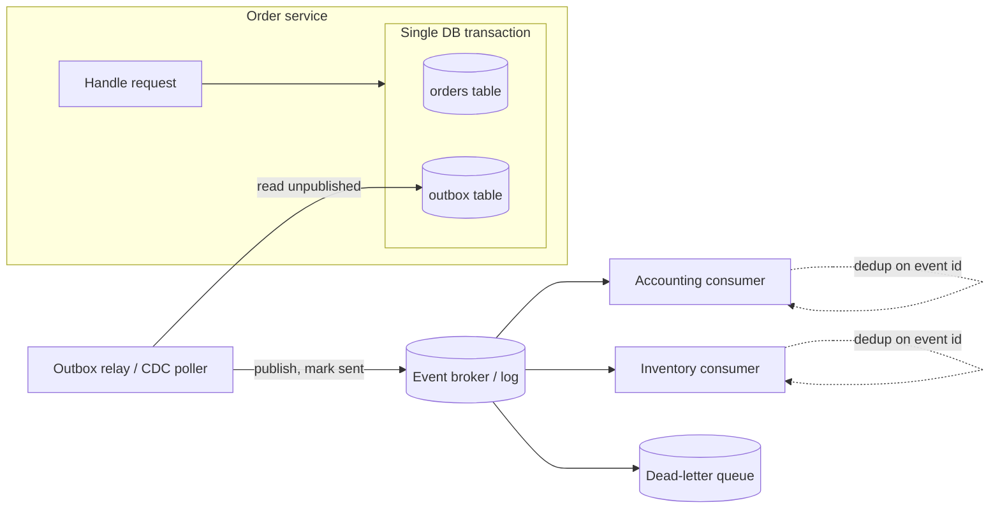

Integration is where a client's systems either become a coherent estate or a fragile web of one-off connectors that nobody dares touch. Two applications talking is easy; twelve applications talking, surviving a vendor outage, replaying after a failed sync, and leaving an audit trail you can reconstruct months later — that is architecture. This guide is the reference we hold our own delivery to when we wire a small or mid-market client's software together: a customer relationship manager feeding an Enterprise Resource Planning (ERP) system, an e-commerce platform reconciling against accounting, or a fleet of software-as-a-service (SaaS) tools that each hold a slice of the same customer.

The through-line is the BASH doctrine: integrations are deterministic, replayable, and observable first — auditable machinery you can reason about — and artificial intelligence (AI) is an overlay on top of that machinery, never the load-bearing wall. AI is genuinely useful for mapping a messy legacy schema, drafting a transformation, or triaging a dead-letter queue. It is not where a payment lands or an inventory count is decremented. If you cannot explain, from logs alone, why a record holds the value it holds, you do not have an integration; you have a rumor with a cron schedule.

## Three integration styles, and when each earns its place

Every integration decision starts with topology. There are three durable styles, and most real estates use more than one on purpose.

- **Point-to-point.** System A calls system B directly. Cheap and obvious for the first connection. The cost is combinatorial: N systems that all need to talk trend toward N-squared connectors, each with its own auth, retries, and failure modes. Two or three such links are fine; the tenth is a maintenance tax you pay forever.
- **Hub-and-spoke / integration platform as a service (iPaaS).** A central broker — MuleSoft, Workato, Boomi, Azure Integration Services, or a self-hosted equivalent — mediates every connection. Each system integrates once, to the hub. This trades a per-connector explosion for a single well-understood mediation layer, at the cost of a platform to run and license.
- **Event-driven.** Systems publish events to a broker (a queue or a log) and interested systems subscribe; producers do not know or care who consumes. This decouples systems in time as well as space: a consumer can be down for an hour and catch up from the log. It is the most resilient pattern and the one that most rewards up-front rigor, because "fire and forget" quietly becomes "fire and lose" without delivery guarantees.

A useful default for an SMB estate: point-to-point for the one or two connections that are genuinely simple and stable, an iPaaS or lightweight broker for the operational middle, and event-driven for anything where a lost message costs money or where consumers get added later without touching producers.

| Question | Point-to-point | Hub / iPaaS | Event-driven |
| --- | --- | --- | --- |
| How many systems? | 2–3 | Several, operational | Several, and growing |
| Coupling tolerance | High — A knows B | Medium — all know the hub | Low — producers know nothing of consumers |
| Cost of a lost message | Low | Medium | High (this is where you buy guarantees) |
| Add a new consumer without touching producers? | No | Sometimes | Yes |
| Operational burden | Per-connector | One platform | One broker plus consumer discipline |

## API design that survives contact with real callers

Most integrations are still request/response over Hypertext Transfer Protocol (HTTP), so API design is where determinism is won or lost. Whether you expose Representational State Transfer (REST) or GraphQL, the same disciplines hold.

**Idempotency is non-negotiable for anything that mutates state.** Networks retry. A client that times out on `POST /orders` does not know whether the order was created, so it retries — and now you have two orders. The fix is an idempotency key: the client sends a unique `Idempotency-Key` header, the server records the key with the result, and a retry with the same key returns the original result instead of acting twice. Stripe's documented approach — [safely retrying requests with idempotency keys](https://docs.stripe.com/api/idempotent_requests) — is the canonical pattern, worth copying exactly rather than reinventing. Make every create-or-mutate endpoint idempotent; it is the single highest-leverage move for making an integration replayable.

**Pagination must be stable under writes.** Offset-based pagination (`?page=3&size=50`) drifts: if a row is inserted while a client walks the pages, records shift and the client double-reads or skips. Prefer cursor-based (keyset) pagination — an opaque cursor that encodes "everything after this stable key" — so concurrent writes do not corrupt a full-table read. This matters enormously for the initial backfill of any sync, which is exactly when the source table is also changing.

**Webhooks need the same rigor you demand from your own APIs.** When you consume a vendor's webhooks, treat every delivery as at-least-once and possibly out of order. That means: verify the signature (a hash-based message authentication code over the payload with a shared secret) before trusting anything; deduplicate on the event's ID so a redelivery is a no-op; return `2xx` fast and process asynchronously so the vendor does not retry a slow handler into a storm; and reconcile periodically against the source of truth, because webhooks get dropped and you cannot detect a message that never arrived without a backstop.

**Version deliberately and expand rather than break.** Put the version in the path (`/v1/`) or a header, and follow Postel's principle of tolerant readers: add fields, never repurpose or remove them without a new version, and let consumers ignore fields they do not recognize. Breaking changes get a new version and a deprecation window measured in months, communicated in writing — not a surprise `500` on a Monday.

GraphQL shifts these problems rather than removing them: the client controls the response shape, but you inherit query-cost and N-plus-one concerns, and idempotency still lives in mutations exactly as it does in REST. Choose GraphQL when clients are diverse and over-fetching is costly; choose REST when the surface is small and cacheable. The disciplines above hold either way.

## Messaging and events: guarantees you can actually reason about

Once you introduce a broker, the central question is delivery semantics. Get precise about them, because the whole resilience story depends on it.

- **At-most-once** — a message is delivered zero or one times. Fast, lossy, almost never what a business integration wants.
- **At-least-once** — a message is delivered one or more times. This is what real brokers (Amazon Simple Queue Service, RabbitMQ, Apache Kafka with typical settings) actually give you. Duplicates happen. You design for them.
- **Exactly-once** — delivered precisely once. True end-to-end exactly-once delivery across a network is, in the general case, not achievable; what systems market as "exactly-once" is at-least-once delivery plus idempotent processing. Do not build on the assumption that a message arrives once.

The practical consequence: **design every consumer to be idempotent**, and at-least-once delivery becomes effectively exactly-once processing. The consumer records the ID of each event it has handled and skips a repeat — the same idempotency-key discipline from the API section, applied to the consuming side. It is the load-bearing pattern of the whole chapter.

Two more mechanics keep a message system honest. A **dead-letter queue (DLQ)** captures messages a consumer cannot process after N retries, so a single poison message neither blocks the queue nor vanishes silently — someone is alerted and the message is preserved for inspection and replay. And **ordering** must be asked for explicitly: most queues do not preserve global order, and even ordered logs only order within a partition. If order matters (state transitions on one entity), key the messages so that entity's events land on a single partition, and accept that cross-entity ordering is not guaranteed.

## The outbox pattern: publishing without lying

Here is the failure mode that quietly corrupts more integrations than any other. A service updates its database and then publishes an event to the broker. These are two separate systems, so there is no shared transaction. If the process dies between the commit and the publish, the database says the order exists and the broker never heard about it — a phantom. Publish first and the mirror-image ghost appears: an event for an order the database never committed.

The **transactional outbox** closes this gap. Instead of writing to the database and then publishing, the service writes the business change and an outbox row in the *same* local database transaction. A separate relay process reads unpublished outbox rows and publishes them to the broker, marking each as sent. Now the event is committed atomically with the data that justifies it; the relay may publish a row more than once (at-least-once, again), which is exactly why every consumer is idempotent. This is the deterministic, replayable core of event-driven integration — the whole point is that state and its notification can never disagree.



The relay has two common implementations. A **polling publisher** queries the outbox table on an interval — simple, portable, adds a little latency. **Change data capture (CDC)** tails the database's transaction log (via Debezium, or a cloud service like AWS Database Migration Service) and emits an event for every committed outbox insert — lower latency, no polling load, but a log-reading component to operate. For most SMB volumes a polling relay is plenty and far easier to run; reach for CDC when latency or throughput demands it.

## Data synchronization: keeping two systems agreeing

Not every integration is an event stream. A great deal of real work is keeping two datastores in agreement, across a spectrum of patterns.

- **Batch extract-transform-load (ETL) or extract-load-transform (ELT).** Pull a dataset on a schedule, transform, load. Simple, auditable, and correct for reporting and nightly reconciliation. The tradeoff is latency — data is as fresh as the last run. ELT (load raw, transform in the warehouse) is the modern default for analytics, covered end to end in [[The modern data stack, end to end]].
- **Change data capture.** The same log-tailing mechanism as the outbox relay, streaming row-level changes from a source database to a target continuously — near-real-time replication without hammering the source with polling queries. CDC is the backbone of low-latency sync between operational systems.
- **API-driven incremental sync.** Poll a source API for records changed since a high-water mark (an `updated_since` timestamp or a persisted sequence number). Portable across SaaS systems that expose no database, but only as reliable as the source's change tracking — and clock skew and soft-deletes are the classic traps.

Two controls make sync trustworthy. First, **reconciliation**: sync logic drifts — a webhook is dropped, a transform hits an edge case, a manual edit slips in on one side — so a scheduled job compares source and target (by count, by checksum, or record by record for critical data) and reports discrepancies before they become a disputed invoice. Treat it as a first-class deliverable; the same discipline underpins clean books in [[Record-to-report automation and controls]]. Second, **name the system of record for every field**: when two systems can both write the same customer address, they diverge and no sync direction saves you. Sync one-directionally from the owning system, and build bidirectional sync only with a real conflict-resolution rule (last-writer-wins on a trusted timestamp, or field-level ownership) — never by accident.

## Authentication and secrets: the part attackers probe first

Every integration is a set of credentials, and credentials are what an attacker most wants. Make this deterministic and least-privilege from the start.

For service-to-service calls, the standard is **OAuth 2.0 client credentials** — a machine client exchanges a client ID and secret for a short-lived access token, then calls the API with that token. The framework is specified in [RFC 6749, the OAuth 2.0 Authorization Framework](https://datatracker.ietf.org/doc/html/rfc6749); the client-credentials grant in section 4.4 is the one that fits backend integration. A leaked token expires on its own; the long-lived secret that mints them is what you must protect hardest.

```http
POST /oauth2/token HTTP/1.1
Host: auth.vendor.example
Content-Type: application/x-www-form-urlencoded

grant_type=client_credentials
&client_id=svc-order-sync
&client_secret=REDACTED
&scope=orders:read invoices:write
```

Three rules keep the auth layer honest. First, **scope tokens narrowly** — an order-sync client should request `orders:read` and nothing else, so a compromised token cannot delete customers. Second, **never store a secret in code, config, or a repository.** Secrets live in a managed secret store — AWS Secrets Manager, Azure Key Vault, GCP Secret Manager, or HashiCorp Vault — fetched at runtime and rotated on a schedule; a secret in git is compromised the moment the repo is. Third, prefer **workload identity over static secrets** where the platform supports it: a workload assumes a cloud role or uses OpenID Connect (OIDC) federation and no long-lived secret exists to leak at all. This is the same identity discipline the foundation is built on, which is why it lives alongside [[Cloud landing zones and infrastructure as code]] rather than being invented per-integration.

## Legacy modernization: strangling the monolith without a big-bang cutover

Most SMB integration work eventually meets a legacy system — an aging line-of-business application, a database with logic in stored procedures, a vendor product you cannot change. The instinct to rip it out in one release is how projects die. Two patterns let you modernize incrementally.

The **strangler-fig pattern** (named for the vine that grows around a tree and gradually replaces it) puts a routing facade in front of the legacy system, which routes each request to either a new service or the legacy system. You migrate capabilities one at a time behind that interface, until the legacy system handles nothing and can be retired. Every step ships independently, every step is reversible, and there is no weekend where everything changes at once. Martin Fowler's write-up of the [strangler fig application](https://martinfowler.com/bliki/StranglerFigApplication.html) remains the clearest statement of why incremental beats big-bang.

The **anti-corruption layer (ACL)** protects your clean new model from the legacy system's messy one. Rather than let a legacy schema's quirks — cryptic column names, overloaded status codes, implicit conventions — leak into new services, you build a translation layer that maps the legacy model to a clean domain model and back. The new services speak your language; the ACL absorbs the impedance mismatch, which is what keeps a modernization from reproducing the old mess in new code. Both patterns are core to the delivery in [[Software development]], where the integration facade and the domain model are designed together.

## Observability: an integration you cannot see is one you cannot trust

Determinism and replayability only pay off if you can observe what happened. Three things are mandatory, not optional.

- **Correlation IDs.** Generate an ID at the edge and propagate it through every hop — API call, event, consumer, downstream call. When a record is wrong, you trace its whole journey by that one ID instead of correlating timestamps across five logs by hand.
- **Structured logs, metrics, and traces at every boundary.** Log every message published and consumed with its ID and outcome; emit metrics for queue depth, consumer lag, DLQ size, and reconciliation discrepancies. Rising consumer lag and a growing DLQ are the two early warnings that catch most integration failures before a human notices bad data.
- **Replayability as a designed capability.** Because events live in a log and consumers are idempotent, you can reprocess from a point in time to recover from a consumer bug — fix the consumer, reset its position, replay. Design for this from day one; retrofitting replay onto a system that discarded its events is not possible.

This is where an AI overlay earns its keep without touching the critical path: summarizing a spike in DLQ messages, clustering transformation errors that share a root cause, or drafting a field mapping for a new source from samples. It accelerates the humans operating the system; the deterministic machinery still decides what a record's value is.

## Anti-patterns to refuse

The failures we see most, named so you can catch them before they take root:

- **Dual writes without an outbox.** Writing to a database and then publishing an event as two separate steps. Sooner or later the process dies between them and your systems disagree permanently. Use the outbox.
- **Non-idempotent consumers on an at-least-once broker.** Every duplicate delivery corrupts state — a double-decremented inventory, a doubled payment. Idempotency is not optional; it is the premise.
- **Point-to-point sprawl.** The eleventh direct connector nobody can map. When the connection count outgrows what one person can draw on a whiteboard, introduce a hub or a broker.
- **Secrets in config or code.** A credential in a repository is compromised on commit. Managed secret store, rotation, and workload identity — no exceptions.
- **Sync with no reconciliation.** An integration that assumes it never drifts. It drifts. Without a reconciliation job you find out from a customer, not a dashboard.
- **Bidirectional sync by accident.** Two systems both writing the same field with no ownership rule. They diverge, and no amount of syncing converges them. Name the system of record.
- **Big-bang legacy replacement.** Replacing a running system in one release. Strangle it incrementally behind a facade instead.

## Your next step

A well-architected integration layer is worth building deliberately, because retrofitting idempotency, an outbox, and reconciliation onto a live web of connectors is several times the effort of designing them in. If you are wiring a client's systems together, untangling a point-to-point mess, or modernizing around a legacy system you cannot rip out, our [[Software development]] work is the reference architecture and hands-on delivery behind everything in this guide. [Start a conversation about your integration landscape](/contact/) and we will map the systems, the data flows, and the deterministic patterns that fit what you are actually building.
