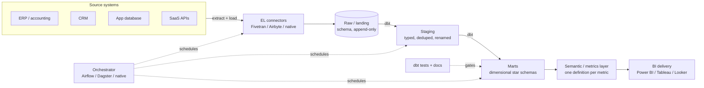

The modern data stack is a solved shape. Land raw data cheaply, transform it in the warehouse with version-controlled SQL, define your metrics once, and serve them to a business-intelligence (BI) tool. The failure mode is not choosing the wrong component — it is over-building the right ones: a Kafka topic where a nightly extract would do, a Kubernetes-hosted orchestrator for eight pipelines, a lakehouse for forty gigabytes. This is the reference we build against for small and medium business (SMB) and lower mid-market clients, where the constraint is not scale but the number of people who can operate what you leave behind.

The through-line is the BASH doctrine, spelled out in [[The deterministic-first doctrine]]: the load-bearing wall is deterministic and auditable. A data pipeline that produces a different number on a re-run is not a data pipeline — it is a rumor. Every stage here is idempotent, tested, and reconstructable, so a dashboard figure traces back through a documented model to a raw record you can point at. Artificial intelligence (AI) is an overlay on this foundation — a natural-language query surface, an anomaly flag — never the load-bearing wall.

## The reference architecture

Almost every SMB analytics need reduces to the same five-stage pipeline: extract and load raw data, transform it into modeled tables, define metrics on top, orchestrate the whole thing on a schedule, and serve it to BI. Draw it once and the tooling decisions fall out of the diagram.



Read it as a one-way flow with two non-negotiable properties. First, raw is immutable: connectors append to a landing schema and nothing downstream mutates it, so a bad transform is always recoverable by re-running from raw. Second, every arrow into the marts passes through a test gate — if the primary key is not unique or a foreign key is orphaned, the run fails loudly rather than shipping a wrong number to a dashboard. That is what "extract-load-transform" (ELT) buys you over the older "extract-transform-load" (ETL): cheap warehouse storage lets you keep the raw truth and make transformation a re-runnable, auditable step instead of a one-shot pipe you cannot inspect after the fact.

## Ingestion: extract and load

The first decision is build versus buy on connectors, and for SMB work the answer is usually buy for standardized sources and build only where you must.

**Managed connectors.** [Fivetran](https://fivetran.com/docs/getting-started) and its peers give you maintained, schema-drift-handling connectors for hundreds of common sources — Salesforce, QuickBooks, Stripe, NetSuite, Postgres. You trade money for not owning connector maintenance, which for a 3–5 source SMB stack is almost always the right trade: a fully-loaded engineer-day costs more than a month of connector fees, and connectors break silently when an upstream API changes. Fivetran's pricing is consumption-based on monthly active rows, which can surprise you on a high-churn table — model it before you commit, and exclude columns you will never use.

**Open-source and self-hosted.** [Airbyte](https://docs.airbyte.com/) covers a similar connector catalog and can run in the client's own environment, which matters when data residency or cost at volume rules out a fully-managed service. The trade is operational: you now own the runtime, upgrades, and the long tail of connector bugs. Choose it deliberately, not reflexively because it is free — the free connector often costs more in engineering time than the paid one.

**Native and hand-built extract.** For a single Postgres application database, a warehouse-native change-data-capture service (BigQuery Datastream replicates directly from Postgres; on Snowflake you land change files and load them with Snowpipe) or a small idempotent extract script can beat a connector platform on both cost and control. The rule for any hand-built extract is the one that governs the whole stack: it must be idempotent and incremental. Use a watermark — an updated-at column or a change-data-capture (CDC) log — load into a staging table, and merge on a business key so a re-run after a failure at 2 a.m. produces exactly the same result as a clean run. A pipeline you cannot safely re-run is a pipeline you cannot operate.

The deeper patterns — CDC versus batch, event streams versus request-response, and wrapping legacy systems that have no clean API — belong to integration architecture proper and are covered in [[Integration architecture: APIs, events, legacy]]. Here the point is narrower: get raw data into the warehouse cheaply, incrementally, and idempotently, and do nothing else in this stage.

## The warehouse: the load-bearing choice

The warehouse is where the stack lives, so this is the decision to make deliberately. All four serious options are columnar, separate storage from compute, and scale far past anything an SMB will produce. The differences that matter are operational and commercial, not raw capability.

- **[Snowflake](https://docs.snowflake.com/en/user-guide-intro).** Cloud-agnostic, with a clean separation of virtual warehouses (compute) from storage, so you can size a small warehouse for BI queries and auto-suspend it when idle. Billing is per-second on running compute; the discipline that keeps the bill sane is aggressive auto-suspend, right-sized warehouses, and not leaving a warehouse running behind a dashboard nobody is looking at.
- **[BigQuery](https://cloud.google.com/bigquery/docs/introduction).** Serverless with no compute to size, which removes an entire class of operational decisions — a genuine advantage for a small team. The default on-demand model bills per terabyte scanned, so a poorly-partitioned table queried by a busy dashboard can produce a startling bill; partition and cluster tables, and consider flat-rate/editions capacity once query volume is predictable.
- **Amazon Redshift.** The right default when the client is already deep in Amazon Web Services and wants the warehouse inside that account and IAM boundary. Serverless Redshift narrows the old operational gap; the pull is integration with the surrounding AWS estate more than any standalone advantage.
- **Azure Synapse / Microsoft Fabric.** The natural choice inside a Microsoft 365 and Power BI shop, where the integration story — one identity model, direct-lake connectivity to Power BI — is the reason to pick it, not the engine in isolation.

The honest decision criteria for SMB: pick the warehouse that matches the cloud and identity system the client already runs, then control cost through auto-suspend, partitioning, and materialization discipline. The engines are close enough that the operational fit and the surrounding ecosystem decide it far more than a benchmark will. Whichever you choose, the cost model is the thing to internalize on day one — compute-time on Snowflake, bytes-scanned on BigQuery — because the same modeling choices that make queries fast also make them cheap. Cloud landing-zone patterns, account structure, and infrastructure-as-code for provisioning all of this live in [[Cloud landing zones and infrastructure as code]].

## Transformation: dbt as the deterministic core

This is the heart of the stack and the part that most embodies the doctrine. [dbt (data build tool)](https://docs.getdbt.com/docs/introduction) is a transformation framework that compiles version-controlled SQL `SELECT` statements into tables and views in the warehouse, resolves the dependency graph between them, and — the part that matters most — tests them. It turns transformation from a pile of stored procedures nobody dares touch into a tested, documented, code-reviewed software project.

Structure the project in layers that mirror the pipeline:

- **Staging** models map one-to-one to source tables: cast types, rename columns to a consistent convention, and deduplicate. Nothing business-specific happens here. Staging is where raw becomes clean.
- **Intermediate** models handle the messy joins and reshaping that would clutter a mart — fanning out a line-item table, resolving a slowly-changing dimension.
- **Marts** are the business-facing tables the BI tool reads: dimensional models organized around how the business actually asks questions.

The tests are the gate. dbt ships two kinds and you use both heavily. Generic tests are declarative and go in a YAML file next to the model:

```yaml
models:
  - name: fct_orders
    columns:
      - name: order_id
        tests:
          - unique
          - not_null
      - name: customer_id
        tests:
          - not_null
          - relationships:
              to: ref('dim_customers')
              field: customer_id
```

That block asserts, on every run, that `order_id` is a unique non-null primary key and that every `customer_id` in the fact table resolves to a real customer dimension. Singular tests are just a SQL query that should return zero rows — "no order has a negative total," "no invoice is dated in the future." When a test fails, the run stops and the bad data never reaches the dashboard. This is the deterministic gate from the architecture diagram made concrete: a wrong number becomes a failed build, not a silent error a controller finds three weeks later.

Two more dbt features carry real weight. Documentation is generated from the same YAML and the model SQL, producing a browsable lineage graph and a data dictionary that is always current because it is derived from the code, not maintained beside it. And incremental materialization lets a model process only new or changed rows on each run rather than rebuilding the full table — the same idempotent, incremental discipline as ingestion, applied to transformation. Configure incremental models with a unique key and a merge strategy so a re-run reconciles rather than duplicates.

## Modeling: dimensional by default

How you model the marts decides whether the warehouse is a pleasure or a punishment to query. The default for SMB analytics is dimensional modeling — the Kimball star schema — and the reasons are practical, not academic.

A star schema puts a **fact table** at the center (one row per business event: an order line, an invoice, a support ticket) surrounded by **dimension tables** (customer, product, date, location) that describe the context of those events. Queries join facts to dimensions to slice measures by attributes: revenue by product by month, tickets by priority by team. The shape is intuitive for analysts, maps directly onto how businesses ask questions, and is exactly what BI tools are built to consume.

- **Grain first.** Declare the grain of every fact table explicitly — "one row per order line per day" — before you write a column. Mixed grain is the single most common modeling defect and it silently double-counts revenue. Every measure in the table must be true at the declared grain.
- **Conformed dimensions.** A `dim_customer` and a `dim_date` shared across every fact table are what let finance and operations agree on what "last quarter" and "this customer" mean. Conformed dimensions are the technical mechanism behind "one source of truth."
- **Star over snowflake, usually.** A snowflake schema normalizes dimensions into sub-dimensions; it saves storage and costs you joins and clarity. At SMB data volumes storage is free and clarity is expensive, so denormalize into flat, wide dimensions and only snowflake when a dimension is genuinely huge or shared in a way that demands it.
- **Wide tables have their place.** For a single-team dashboard on one BI tool, one wide "one big table" that pre-joins a fact with its dimensions can be simpler and faster than a formal star, and column-store warehouses handle the width well. Reach for it when the audience is narrow; reach for a conformed star when multiple teams and tools must agree. This same dimensional layer is where an ERP's transactional data becomes reportable — the modeling that turns a general ledger into analyzable facts and dimensions is covered from the source side in [[ERP implementation architecture]].

## The semantic layer: define each metric once

Here is where most SMB stacks quietly go wrong. The star schema gives you clean tables, but "revenue" still gets defined independently in every dashboard — one analyst includes freight, another nets out refunds, a third uses booking date instead of ship date. Three dashboards, three numbers, and a meeting spent arguing about which is right.

A semantic (or metrics) layer fixes this by defining each metric once, in code, between the marts and the BI tool. A metric definition names the measure, the aggregation, the fact table it comes from, and the dimensions it can be sliced by — and every consumer that asks for "revenue" gets the same computation. dbt's semantic layer, LookML in Looker, and the semantic models inside Power BI all serve this role. The principle matters more than the product: the definition of a metric is code, it is version-controlled, it is reviewed, and it is the only place the calculation lives. When someone asks why the number changed, you point at a commit.

For a smaller stack you can approximate this with a disciplined marts layer — pre-compute the canonical measures in dbt so the BI tool only ever displays, never redefines. That is often enough to start. The trap to avoid is metric logic scattered across BI tool report definitions where it cannot be tested, reviewed, or reused; that is how you end up with the spreadsheet problem again, one abstraction layer higher.

## Orchestration: schedule, don't cron-and-pray

Something has to run the connectors, then dbt, then trigger the BI refresh, in order, on a schedule, with alerting when a step fails. Match the orchestrator to the operational maturity of the team that will own it.

- **Native and managed first.** dbt Cloud's built-in scheduler, a warehouse task, or a cloud-native scheduler runs a linear daily pipeline with almost no operational burden. For most SMB stacks this is the correct answer and the more powerful options are over-engineering.
- **[Dagster](https://docs.dagster.io/getting-started).** When dependencies get real, Dagster's asset-oriented model — you declare the data assets and their dependencies, and it works out what to run — fits an analytics pipeline more naturally than task-graph tools and gives you data-aware scheduling and lineage out of the box.
- **Apache Airflow.** The incumbent, with the largest ecosystem, and the right pick when the client already runs it or needs its breadth of integrations. The cost is operational weight — it is genuinely more infrastructure to run and reason about than a small analytics pipeline warrants unless you are already invested.

Whatever you choose, the requirements are the same and they are modest: run stages in dependency order, retry a transient failure, alert a human on a real one, and make every task idempotent so a retry is always safe. Do not stand up Airflow on Kubernetes for eight nightly models. The orchestrator is plumbing, and the doctrine on plumbing is to use the least of it that does the job.

## BI delivery and governance

The last mile is the BI tool, and the choice mostly follows the ecosystem the client already lives in. [Microsoft Power BI](https://learn.microsoft.com/en-us/power-bi/fundamentals/power-bi-overview) is the default in Microsoft 365 shops — modest per-user licensing, deep Azure and Excel integration. Tableau leads on exploratory, visually rich analysis for analyst-heavy teams. Looker's strength is that its modeling layer (LookML) enforces governed metric definitions centrally, which is the semantic-layer discipline built into the tool. Any of them serves an SMB well; the differentiator is fit with the existing stack and the skills of the people who will maintain it.

Governance is the part teams skip and later regret. The controls that matter at SMB scale are few and concrete:

- **Certified datasets.** Publish a small number of governed, semantic-layer-backed datasets that report authors build on, rather than letting every author connect straight to raw tables and reinvent the metrics.
- **Row-level security.** Enforce who sees which rows — a regional manager sees their region — in the semantic model or warehouse, not in the visual, so it holds no matter how the data is queried.
- **Access by role.** Warehouse and BI permissions follow the same least-privilege pattern as the rest of the estate, tied to the identity system rather than managed per-tool.
- **A short official list.** One curated set of certified dashboards, ruthlessly pruned. Dashboard sprawl — twenty near-duplicates and no one sure which is current — is the analytics equivalent of technical debt.

Governance here is a slice of the broader security and identity program described in [[Security architecture for small business]], not a separate BI-only concern.

## Starting small

The mistake is building all five stages before shipping one number. Do the opposite. Pick one high-value question — "what is margin by product this month" — and build the thinnest vertical slice that answers it: one source loaded to raw, a handful of dbt models with tests, one metric defined once, one dashboard reconciled against a figure the controller already trusts. Get that slice green in continuous integration, then widen it one source and one question at a time.

Keep raw immutable, keep every transform idempotent and tested, define each metric exactly once, and let AI sit on top as a query surface rather than underneath as the pipeline. A stack built this way is one a two-person team can operate and an auditor can trace — which is the whole point.

If you are architecting a data stack for an SMB or mid-market client and want a second set of eyes on the warehouse choice, the dbt project structure, or the semantic layer, our [[Data and BI]] practice builds exactly these — deterministic pipelines and dashboards that reconcile. When you are ready to pressure-test a design, [start a conversation](/contact/).
