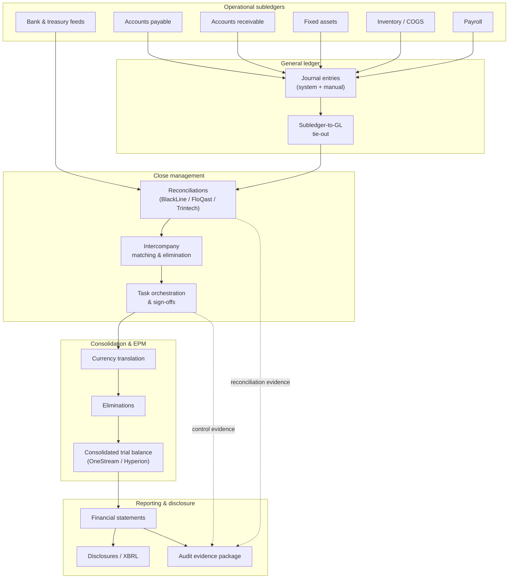

The record-to-report (R2R) cycle is the part of the finance function that turns transactions into signed financial statements. It spans the general ledger (GL), subledger integration, reconciliations, intercompany, consolidation, and the disclosure and reporting layer. For a senior architect, R2R is interesting precisely because it is a control system before it is an accounting system: every step has to produce evidence that a human can defend to an auditor, and every automation has to preserve — not erode — that evidence trail.

This is where the BASH doctrine earns its keep. The close is the wrong place to let a probabilistic model make load-bearing decisions. The reference architecture here is deterministic-first: rules, reconciliations, and orchestration are code and configuration you can replay and prove; artificial intelligence (AI) is an overlay that drafts, matches, and explains, but always logs its output as a preparer action awaiting human review. If you have read [[The deterministic-first doctrine]], this is that doctrine applied to the one process where a silent error compounds into a restatement.

## The R2R cycle as a data pipeline

Treat the close as an extract-transform-load (ETL) pipeline with control gates, not as a sequence of spreadsheets. Data flows from operational subledgers into the GL, gets reconciled and adjusted, rolls up through consolidation, and lands in the reporting and disclosure layer. Each arrow in that flow is a place where data can be lost, duplicated, or silently transformed — so each arrow needs a control.

The architectural rule is that every node emits evidence to the audit package, and every gate between nodes is a control you can name, test, and prove. If a step cannot produce evidence, it is not done — it is merely finished.

## Close automation: subledger to GL

The foundation of a fast, defensible close is a clean subledger-to-GL interface. Most delay and most restatement risk lives here, in the handoff between operational systems and the ledger.

### Interface patterns that hold up

- **Subledger posting.** Accounts payable (AP), accounts receivable (AR), fixed assets, inventory, and payroll each summarize to the GL on a defined cadence. The non-negotiable control is a **subledger-to-GL tie-out**: the sum of open items in the subledger must equal the control account balance in the GL, every period, with any variance explained. Enterprise Resource Planning (ERP) platforms enforce this natively when configured correctly — this is one of the reasons the ledger architecture in [[ERP implementation architecture]] matters so much for the close.
- **Bank and treasury interfaces.** Bank feeds should arrive as structured data — ideally ISO 20022 `camt.053` end-of-day statements or Bank Administration Institute (BAI2) files — not as manually keyed balances. Treasury and cash positioning then reconcile against the GL cash accounts automatically. Structured formats matter because they carry stable transaction identifiers you can match on deterministically, which is the difference between a rules-based reconciliation and a fuzzy guess.
- **Intercompany.** Intercompany transactions are the single most common source of consolidation pain. Architect them with a shared reference (a trading-partner dimension and a transaction key) so that both sides post with a matchable identifier. Elimination then becomes a deterministic join, not a manual investigation.

### Manual journal entries: the highest-risk path

System-generated postings are relatively safe because they follow configured rules. Manual journal entries are where errors and fraud concentrate, so the control design has to be strongest here:

- Every manual entry carries a **preparer** and an independent **approver** (segregation of duties).
- Entries above a materiality threshold route to a higher approval tier.
- Supporting documentation attaches to the entry itself, so the evidence and the posting never separate.
- Recurring and accrual entries are templated and, where possible, driven by rules rather than re-keyed each period.

This is exactly the boundary where AI is useful but must be constrained: a model can draft a manual accrual or propose an entry from a supporting document, but the draft lands in the preparer's queue with the model tagged as its author. A person reviews and posts. The model never holds posting authority.

## Reconciliation and close-management tooling

Reconciliation is the control that proves the GL reflects reality. Close-management platforms — BlackLine, FloQast, Trintech, and the ERP-native close modules — exist to industrialize three things: reconciliation, task orchestration, and evidence retention.

### Reconciliation patterns

- **Auto-certification for low-risk accounts.** Accounts that are zero-balance, or that match a source system within tolerance, can auto-certify under a defined rule. This is deterministic: the rule either passes or it doesn't, and the pass/fail is logged. Auto-certification is what lets a team of five reconcile hundreds of accounts without cutting corners.
- **Risk-ranked manual reconciliation.** High-value or judgmental accounts (accruals, reserves, suspense, intercompany) always get human preparer-and-reviewer treatment. Ranking accounts by risk lets you spend scarce human attention where it changes the answer.
- **Transaction matching.** For high-volume accounts — bank, merchant settlement, clearing — rules-based matching engines pair debits and credits on stable keys (amount, date, reference). What remains after the deterministic pass is the exception queue, and the exception queue is the real work.

The tooling matters less than the pattern. FloQast leans into a checklist-and-tie-out model layered over the existing ERP and spreadsheets; BlackLine and Trintech push toward a matching-engine and certification-workflow model with heavier configuration. The architectural decision is how much of the close you want to move out of spreadsheets and into a controlled system of record — and that decision should be driven by audit risk and volume, not by feature lists.

### Task orchestration and the close calendar

A close-management platform is, underneath, a workflow engine with a control overlay. The close calendar defines every task, its owner, its dependencies, and its due time; sign-offs are recorded with a timestamp and identity. This produces the operational spine of the audit evidence package: who did what, when, and in what order. When an auditor asks "how do you know the close was performed as designed," the answer is the task log, not a person's memory.

## Consolidation and enterprise performance management

Once the GLs are closed and reconciled, consolidation rolls multiple entities into a single set of statements. At the architecture level, enterprise performance management (EPM) platforms — OneStream, Oracle Hyperion Financial Management and its successors, and comparable tools — handle four things that a GL cannot do cleanly on its own:

- **Currency translation.** Local-currency trial balances translate to the reporting currency using method-appropriate rates (current-rate for balance sheet, average for income statement, historical for equity), with the cumulative translation adjustment landing in equity. This is deterministic math driven by a rate table — exactly the kind of step that should never be a spreadsheet formula someone can overwrite.
- **Eliminations.** Intercompany balances and profit-in-inventory eliminate on consolidation. This is only clean if the intercompany data carried matchable identifiers upstream, which is why the interface design earlier in the pipeline determines how painful consolidation is here.
- **Ownership and minority interest.** Partial ownership drives proportional consolidation and non-controlling interest calculations from an ownership dimension.
- **The consolidated trial balance and audit trail.** The output is a consolidated trial balance that ties back, entity by entity, to the source ledgers — with a drill-path from the consolidated number down to the originating journal entry.

The design principle carried through from the ledger holds here: the consolidation logic is configuration and rules you can replay against a prior period and get the identical answer. If a consolidation cannot be reproduced deterministically, it cannot be audited, and an EPM tool that hides its calculation logic is a liability, not a feature.

## Control design mapped to frameworks

Automation is only defensible if it is mapped to a recognized control framework. In the United States the anchor is the Committee of Sponsoring Organizations of the Treadway Commission (COSO) Internal Control — Integrated Framework, which is the framework most public companies use to satisfy Sarbanes-Oxley Act Section 404, and which private companies increasingly adopt for lender and diligence readiness. The COSO framework organizes internal control into five components — control environment, risk assessment, control activities, information and communication, and monitoring activities — supported by seventeen principles. See the [COSO Internal Control — Integrated Framework](https://www.coso.org/guidance-on-ic) for the authoritative statement.

The R2R controls that carry the most audit weight map cleanly onto COSO's control activities and monitoring components:

| Control | What it enforces | COSO component | How automation strengthens it |
| --- | --- | --- | --- |
| Segregation of duties (SoD) | Preparer and approver are different identities; posting and payment are separated | Control activities | Workflow enforces distinct roles; the system rejects self-approval |
| Subledger-to-GL tie-out | Subledger balances equal control accounts | Control activities | Automated tie-out flags variance before close proceeds |
| Reconciliation certification | Every account reconciled and signed by period-end | Control activities | Platform tracks status, blocks close if incomplete |
| Manual JE approval | Judgmental entries reviewed above threshold | Control activities | Threshold routing and attached evidence are enforced, not optional |
| Close task sign-off | Each step performed, in order, by its owner | Monitoring activities | Timestamped task log is the monitoring evidence |
| Change and access logging | Only authorized users change configuration | Information & communication | Immutable logs capture every configuration and posting change |

### Segregation of duties as an architecture problem

Segregation of duties (SoD) is easy to state and hard to enforce, because it is fundamentally an access-control problem. The clean pattern is role-based access control (RBAC) where roles are defined by function (preparer, reviewer, approver, administrator) and a rules matrix flags any user who holds a toxic combination — for example, the ability to both create a vendor and approve a payment to it. In an ERP context, SoD enforcement lives in the security model, which is another reason the ledger and security design belong together. For the broader access-control and identity picture around the finance stack, [[Security architecture for small business]] covers the baseline the finance controls depend on.

### Audit evidence as a first-class output

The mistake teams make is treating audit evidence as something they assemble at year-end. In a well-architected R2R pipeline, evidence is emitted continuously as a byproduct of doing the work: the reconciliation certification, the approval timestamp, the tie-out result, the change log. The auditing standards define what constitutes sufficient and appropriate audit evidence — see the Public Company Accounting Oversight Board (PCAOB) standard [AS 1105, Audit Evidence](https://pcaobus.org/oversight/standards/auditing-standards/details/AS1105) for the authoritative treatment (the American Institute of Certified Public Accountants (AICPA) AU-C Section 500 is the private-company counterpart). The architectural implication is direct: design each control so its evidence is captured automatically, immutably, and with clear provenance, because retrofitting evidence after the fact is both expensive and, to an auditor, suspicious.

## Logging AI-assisted steps as auditable preparer actions

This is the crux of applying the BASH doctrine to R2R, and it deserves precision. AI is genuinely useful in the close: drafting flux (variance) analysis narratives, proposing reconciliation matches for the exception queue, extracting values from supporting documents, and suggesting accrual entries. What AI must never do is post, certify, or sign — those are human control acts that carry accountability.

The design pattern that reconciles usefulness with auditability is to treat every AI output as a **preparer action awaiting human review**, logged with the same rigor as a human preparer's work:

- The AI-generated draft is written to the same queue a human preparer would use, tagged with the model identifier and version as its author.
- The prompt, the source data references, and the model output are captured as the draft's provenance — so the reasoning is reconstructable.
- A human reviewer is a required, non-bypassable step. The reviewer's certification is what moves the item forward; the model's suggestion never auto-certifies.
- The audit log records the full chain: model drafted → human reviewed → human posted, with identities and timestamps at each hop.

Consider a concrete case: at a Denver distributor with roughly 40 staff and four legal entities, a model drafts the monthly intercompany accrual and the flux narrative for the consolidated income statement. Under this pattern, the draft appears in the accountant's queue attributed to the model, the accountant reviews it against the source data, edits the narrative, and posts. The audit trail shows a machine-assisted draft and a human decision — which is stronger evidence than a hand-keyed entry with no draft history, because both the input and the human judgment are captured.

This is the deterministic-first doctrine made concrete for finance: the load-bearing controls (tie-outs, reconciliations, SoD, sign-offs) are deterministic and replayable; AI is an overlay that accelerates the human's first draft without ever holding authority. The failure mode to design against is **automation that erases the human decision point** — a model that silently posts entries destroys the one thing the whole R2R apparatus exists to produce: a defensible trail of human judgment.

## Anti-patterns to design against

A few failure modes show up repeatedly and are worth naming so you can catch them in a design review:

- **Spreadsheet consolidation.** A consolidation workbook with manual links is unauditable, unversioned, and breaks the first time an entity is added. Move consolidation into a system with a replayable calculation engine.
- **Reconciliations without exception discipline.** Auto-matching that hides its unmatched items is worse than no matching, because it creates false confidence. The exception queue must be visible and worked.
- **SoD enforced by policy, not by the system.** If a policy says preparer and approver must differ but the system allows self-approval, you do not have the control — you have a hope.
- **AI given posting authority.** Any design where a model writes to the ledger without a required human review step is a control gap dressed up as efficiency.
- **Evidence assembled at year-end.** If the audit package is a scramble rather than a byproduct, the controls are not really operating — they are being reconstructed, which is a red flag in itself.

## Where to start

The sequencing that works is deterministic-first, in this order: clean the subledger-to-GL interfaces and tie-outs; industrialize reconciliation and the close calendar in a controlled system; move consolidation off spreadsheets into an EPM tool with a replayable engine; map every control explicitly to COSO and wire evidence capture into each step; and only then layer AI as a logged preparer overlay. Building AI in before the deterministic foundation is solid is exactly the load-bearing-wall mistake the doctrine warns against.

If you are architecting or remediating an R2R cycle and want the controls engineered correctly the first time — deterministic foundations, framework-mapped controls, and AI kept firmly in the preparer's seat — our [[Finance tech]] practice does exactly this work. [Tell us where your close breaks down](/contact/) and we will map the reference architecture to your entities, systems, and audit requirements.
