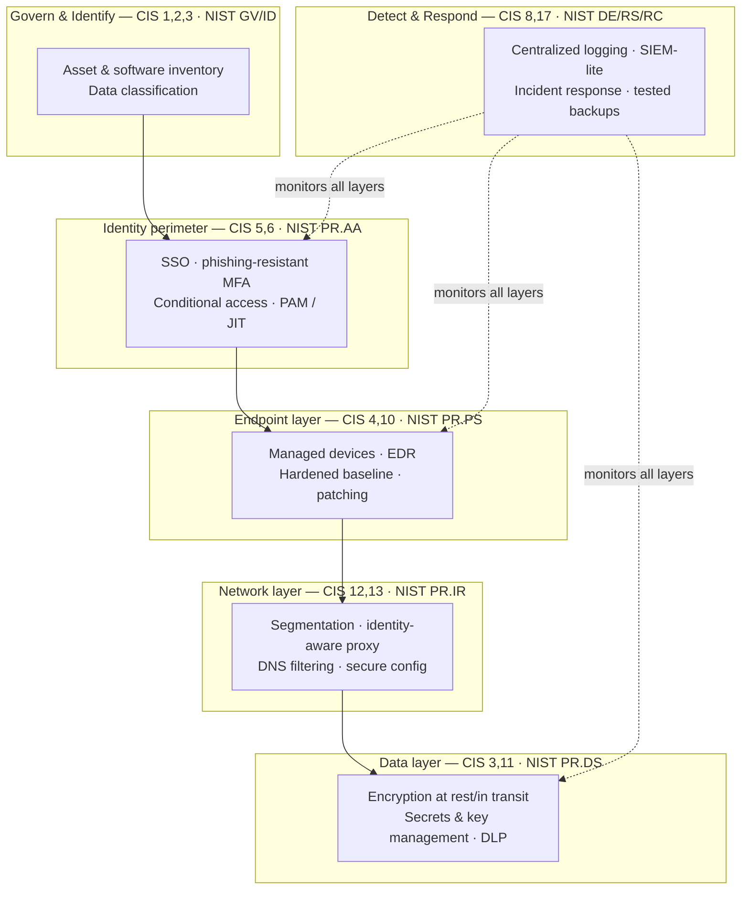

Enterprise security architecture assumes a security team, a budget with a comma in it, and a tolerance for tools that need a full-time analyst to operate. Small and mid-market businesses have none of those and the same threat actors. The job of an architect serving that market is not to shrink the enterprise stack — it is to choose the small set of controls that stop the attacks that actually happen, wire them together so they reinforce each other, and make the whole thing operable by one or two people plus a managed provider. This is the reference we hold our own delivery to.

The through-line is the BASH doctrine. Security is a deterministic, auditable foundation: policy expressed as configuration, access proven by a single identity source, logs you can query, and recovery you have tested. Artificial intelligence (AI) belongs in this stack as an overlay — for alert triage, log summarization, and phishing detection — never as the load-bearing wall. An AI that decides who gets access, with no deterministic policy underneath it, is a control you cannot audit and an auditor will not accept. Put the deterministic controls in first; let AI make them faster to operate.

Two primary sources anchor everything below. The [CIS Critical Security Controls, version 8.1](https://www.cisecurity.org/controls/cis-controls-list) give you a prioritized, prescriptive control set with Implementation Groups that scale by organization size. The [NIST Cybersecurity Framework 2.0](https://www.nist.gov/cyberframework) gives you the six-function outcome language — Govern, Identify, Protect, Detect, Respond, Recover — that leadership, auditors, and cyber-insurance carriers speak. Use CIS to decide what to build and NIST CSF to describe why, and you can hold a coherent conversation with both an engineer and a board.

## Right-size the target before you design

The single most common failure in SMB security architecture is importing an enterprise threat model. Design for the adversary the client will actually meet: commodity ransomware, business email compromise, credential stuffing against exposed services, and the occasional insider mistake. Nation-state persistence is not the design center for a 40-person Denver distributor.

CIS encodes this directly with Implementation Groups (IGs). IG1 is the roughly 56 safeguards that constitute essential cyber hygiene — the baseline every organization should meet regardless of size. IG2 adds controls for organizations managing more sensitive data or more complex operations; IG3 targets organizations with dedicated security staff and regulatory exposure. Most of our SMB clients land at IG1 with a handful of IG2 safeguards where a compliance obligation demands it. Naming the target IG in the first design document keeps scope honest and gives you a defensible line when someone asks why you did not deploy a network detection and response appliance for a company with fourteen laptops.

## Identity is the perimeter

The network edge stopped being the security boundary when the workforce went laptop-and-SaaS. For an SMB whose "data center" is Microsoft 365 or Google Workspace plus a dozen software-as-a-service (SaaS) applications, identity is the only perimeter that is consistently present at every access decision. Architect it first; everything else is downstream.

**Single sign-on (SSO) as the front door.** Consolidate authentication behind one identity provider (IdP) — Microsoft Entra ID or Google Workspace for most SMBs, Okta where the estate is heterogeneous. Every application that supports Security Assertion Markup Language (SAML) or OpenID Connect (OIDC) federates to it. The architectural win is not convenience; it is that you now have one place to enforce policy, one place to disable an account on termination, and one audit log for authentication. Applications that cannot federate become a documented exception list, not a silent sprawl of local passwords.

**Phishing-resistant multi-factor authentication (MFA).** MFA is table stakes, but not all factors are equal. Short Message Service (SMS) and voice codes are phishable and SIM-swappable. Push-based authenticators are better but vulnerable to MFA fatigue. The architecture target is phishing-resistant MFA — FIDO2 security keys or platform passkeys — for administrators without exception, and for the general workforce as fast as the change budget allows. [NIST Special Publication 800-63B](https://pages.nist.gov/800-63-3/sp800-63b.html) sets out the authenticator assurance levels; treat AAL2 as the floor and phishing-resistant AAL3 as the target for privileged accounts.

**Conditional access as policy-as-configuration.** This is where identity becomes an actual control plane rather than a login page. Conditional access (Entra) or context-aware access (Google) evaluates signals — user, group, device compliance, location, sign-in risk — and decides allow, block, or step-up. A sound baseline: require compliant or managed devices for access to email and file storage, block legacy authentication protocols outright, require MFA on every sign-in from an unmanaged context, and raise the bar for administrative roles. Keep these policies in version control as exported configuration or Terraform where the provider supports it, so a policy change is a reviewed commit, not a click nobody remembers making.

**Privileged access management (PAM).** Standing administrative access is the highest-value target in the estate and the thing least often controlled at SMB scale. The pragmatic pattern is just-in-time elevation: no permanent global-admin memberships, roles activated for a bounded window through Privileged Identity Management (Entra) or an equivalent, with approval and logging. Separate the human's daily-driver account from their admin account. Store break-glass credentials — the two emergency accounts excluded from conditional access so a policy mistake cannot lock everyone out — offline, in a sealed vault, monitored for use. This is CIS Control 5 (Account Management) and Control 6 (Access Control Management) made concrete.

## Zero trust, applied pragmatically

Zero trust is an architecture principle, not a product: never trust implicitly, verify every request against policy, and assume the network is hostile. [NIST Special Publication 800-207](https://csrc.nist.gov/pubs/sp/800/207/final) is the reference definition. The mistake at SMB scale is treating it as a microsegmentation megaproject. Applied pragmatically, zero trust for an SMB is mostly identity and device posture doing the work the firewall used to:

- **Every access decision is policy-evaluated** through conditional access — no implicit trust because a request came from the office network.
- **Device posture is a required signal.** Access to sensitive data requires a managed, compliant endpoint (enrolled in Intune, Jamf, or an equivalent mobile device management tool), not merely a valid password and MFA.
- **Application access replaces network access.** A remote user reaches a specific internal application through an identity-aware proxy — Entra Application Proxy, Cloudflare Access, or Google's Identity-Aware Proxy — instead of a virtual private network (VPN) that drops them onto a flat internal subnet.
- **Least privilege is the default,** enforced through group-based role assignment reviewed on a schedule, not accreted permissions nobody revisits.

You do not need to boil the ocean. Retiring the always-on VPN in favor of identity-aware application access, and requiring device compliance for data access, delivers most of the zero-trust benefit an SMB will ever realize.

## Defense in depth: the layers below identity

Identity is the primary perimeter, but a single control is a single point of failure. Layer independent controls so that the failure of any one does not become a breach. The diagram below is the mental model we design against — concentric layers, each assuming the one outside it may be bypassed.

**Endpoint.** The endpoint is where identity gets used and where ransomware lands. Every device is managed and enrolled, carries endpoint detection and response (EDR) rather than legacy signature antivirus, and is built from a hardened baseline. Use the [CIS Benchmarks](https://www.cisecurity.org/cis-benchmarks) for Windows, macOS, and mobile as the configuration standard, applied through the mobile device management tool so the baseline is enforced state, not a checklist. Patching is a control, not a chore: CIS Control 7 (Continuous Vulnerability Management) wants a defined cadence with a measured mean time to remediate, not "Windows Update is on."

**Network.** For a SaaS-centric SMB the network layer is thinner than it used to be, but it is not gone. Segment the office network so that guest, corporate, and any operational-technology or point-of-sale devices sit on separate virtual local area networks (VLANs) that cannot route to each other freely. Run domain name system (DNS) filtering to block known-malicious domains before a connection is made. Where an on-premises server or line-of-business appliance remains, put it behind the identity-aware proxy rather than a port forward. Firewall rules and network configuration are managed as reviewed configuration, consistent with the same infrastructure-as-code discipline covered in [[Cloud landing zones and infrastructure as code]].

**Data.** Encryption at rest and in transit is now a default in every serious cloud service; the architect's job is to verify it is on and to control the keys. Classify data at least coarsely — public, internal, confidential, regulated — because the classification drives every downstream control decision. Where a compliance obligation applies, data-loss-prevention policies in Microsoft Purview or the Google equivalent enforce handling rules on the classified subset rather than blanketing the whole estate with friction.

## Secrets and key management

Hard-coded credentials in configuration files and repositories are among the most reliable ways an SMB gets compromised, because they survive employee turnover and end up in backups and chat logs. The architecture rule is simple: no secret in source, ever. Machine and application secrets live in a managed secret store — AWS Secrets Manager, Azure Key Vault, Google Secret Manager, or HashiCorp Vault — retrieved at runtime and rotated on a schedule. Human secrets live in a team password manager with SSO and its own MFA.

For workloads, prefer identity over secrets entirely. Cloud workload identity — identity and access management (IAM) roles for AWS compute, managed identities in Azure, workload identity federation in Google Cloud — removes the long-lived key from the picture, which removes the thing that leaks. Encryption keys belong in the cloud key management service with a documented rotation policy; reserve customer-managed keys for the data classifications that actually require the extra control, because the operational burden is real. This is CIS Control 3 (Data Protection) at the key-management level, and it is exactly the kind of deterministic, auditable foundation the BASH doctrine puts before any AI overlay.

## Detection: logging and response at SMB scale

You cannot respond to what you cannot see, and most SMBs are effectively blind. The architecture goal is a queryable, centralized, tamper-resistant record of security-relevant events, not a full enterprise security operations center. Call it SIEM-lite: the security-information-and-event-management pattern, sized down.

**Collect the events that matter.** Prioritize identity provider sign-in and audit logs, EDR telemetry, cloud control-plane audit logs (AWS CloudTrail, Azure Activity/Entra logs, Google Cloud Audit Logs), and email security events. These four sources catch the overwhelming majority of SMB incidents. CIS Control 8 (Audit Log Management) specifies collection, central retention, and — critically — protecting the logs from the attacker who wants to erase them.

**Centralize and retain.** Ship logs to one place — Microsoft Sentinel with a cost-managed workspace, a lightweight SIEM such as Elastic Security, or a managed detection and response (MDR) provider's platform. Store them where the compromised identity cannot delete them: a separate log-archive account or an append-only, immutable bucket. Ninety days hot for investigation and a year cold for compliance is a reasonable SMB default; tune to the applicable regulation.

**Detect and triage.** Start with high-signal detections — impossible-travel sign-ins, new global-admin grants, mass file downloads, EDR critical alerts, disabled security tooling — rather than a thousand noisy rules. This is the layer where AI earns its place as an overlay: summarizing an alert's context, correlating across sources, and drafting the first-pass timeline. The deterministic detection rule fires; AI makes the human triage faster. The rule is auditable; the AI is an accelerant. For most SMBs the honest answer is co-managed detection with an MDR partner providing 24/7 eyes, which is squarely the kind of ongoing operational responsibility covered by [[Managed IT services]].

## Incident response and backup integrity

Detection without a response plan is just an earlier warning of a bad outcome. Every SMB needs a written, tested incident-response plan proportionate to its size. [NIST Special Publication 800-61 Revision 2](https://csrc.nist.gov/pubs/sp/800/61/r2/final) is the reference for the lifecycle — preparation, detection and analysis, containment, eradication and recovery, and post-incident activity. Sized for an SMB, the plan that matters fits on a few pages and answers concrete questions: who has authority to isolate a machine or disable an account, who calls the cyber-insurance carrier and the managed provider, where the contact list and runbooks live offline, and what the communication path is when email itself is compromised. A plan that lives only in the email system you are trying to recover is not a plan.

Backup integrity is the control that turns a ransomware event from an existential crisis into a bad week, and it is the one most often quietly broken. The architecture requirement, following the 3-2-1 principle, is three copies of the data, on two media types, with one off-site — and at least one copy immutable or air-gapped so the attacker who reaches your production identity cannot also encrypt or delete the backups. That last property is what modern ransomware specifically targets. The non-negotiable practice: test restores on a schedule and record the recovery time actually achieved. An untested backup is a hypothesis, not a control. The full recovery-side discipline — recovery objectives, immutability, and restore testing — is developed in [[Backups and recovery that actually work]], and the foundational controls that every one of these layers builds on are laid out in [[The security baseline every small business needs]].

## Compliance mapping without the theater

Regulatory frameworks feel like a separate universe, but most of what they require is the control set above, described in their vocabulary. Map controls to frameworks; do not build a parallel compliance program. And never claim a certification you do not hold — describe what a framework requires and where the client's controls stand against it.

| Framework | Nature | What it actually requires (in brief) | Where it overlaps the architecture above |
| --- | --- | --- | --- |
| CIS Controls v8.1 | Prescriptive control set | 18 controls, 153 safeguards, tiered by Implementation Group | Is the architecture — IG1 is the SMB baseline |
| NIST CSF 2.0 | Outcome framework | Six functions: Govern, Identify, Protect, Detect, Respond, Recover | Describes the same controls as risk outcomes for leadership |
| HIPAA Security Rule | US healthcare regulation | Administrative, physical, technical safeguards for electronic protected health information | Access control, audit logging, encryption, contingency planning — all above |
| PCI DSS v4.0 | Card-industry standard | Protect cardholder data across 12 requirements | Segmentation, MFA, logging, secure configuration, key management |
| SOC 2 | Attestation report | Auditor attests controls against Trust Services Criteria | Evidence that identity, change, and monitoring controls operate over time |

The practical move is a single control matrix: one row per implemented control, columns cross-referencing the CIS safeguard, the NIST CSF subcategory, and any applicable regulatory citation. Build the controls once, evidence them once, and satisfy every framework that maps to them. When a Health Insurance Portability and Accountability Act (HIPAA) obligation or a Payment Card Industry Data Security Standard (PCI DSS) scope appears, you are extending an existing matrix, not starting a compliance project from zero. This matrix is also the artifact that makes a future System and Organization Controls (SOC 2) audit or a cyber-insurance renewal a document-retrieval exercise rather than a fire drill.

## Sequencing and anti-patterns

Order matters, because a control layered onto a broken foundation inherits the break. A defensible sequence for a greenfield SMB engagement:

1. **Inventory first** (CIS 1 and 2). You cannot protect assets you have not enumerated. Everything downstream scopes against this.
2. **Lock down identity** — SSO, phishing-resistant MFA for admins, conditional access baseline, PAM for privileged roles.
3. **Harden and instrument endpoints** — managed enrollment, EDR, hardened baseline, patch cadence.
4. **Centralize logging and stand up high-signal detection.**
5. **Prove recovery** — immutable backups and a tested restore before you consider the foundation complete.
6. **Layer AI overlays and map to compliance** once the deterministic base is operating.

The anti-patterns are as instructive as the sequence. **Buying tools before writing policy** produces a rack of dashboards nobody watches. **MFA on the general workforce but not on the break-glass and service accounts** leaves the widest door unlocked. **Backups that have never been restored** are the single most common gap we find and the most dangerous. **Flat networks with implicit trust from "the office"** contradict everything zero trust asks for. And the doctrine-level one: **an AI making access or detection decisions with no deterministic policy underneath** — a control you cannot audit, cannot reproduce, and cannot defend to a carrier or a regulator. Keep the load-bearing wall deterministic; let AI make it faster to operate, never make it the wall.

## Where this goes next

Security architecture is not a document you deliver and walk away from — it is a set of controls someone has to operate every day, tune as the estate changes, and prove during an incident at the worst possible moment. That ongoing operation is exactly what a managed security practice exists to carry.

If you are architecting or reassessing a security foundation for a small or mid-market client and want a second set of senior eyes on the identity model, the detection strategy, or the compliance mapping, our [[Managed IT services]] practice designs, deploys, and operates the stack described here. [Start a conversation](/contact/) about where your client's foundation stands today.
